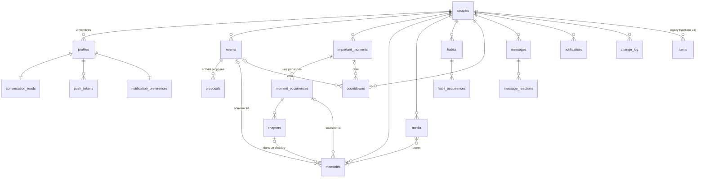

# 03 — Modèle de données

> Statut : **proposition à valider** (Phase 3 de la roadmap). Rien n'est encore migré.
> Le schéma actuel (table unique `items`) reste en place et continue de servir le site web
> tant que les sections historiques ne sont pas portées.

## 1. Principes

1. **Une table par entité** pour tout ce qui est nouveau (calendrier, moments, souvenirs,
   habitudes, messagerie, notifications). Le modèle « tout est un item JSON » de la v1 a
   permis de démarrer vite, mais il interdit les index par période, l'intégrité
   référentielle, les règles RLS fines et les triggers temps réel ciblés — tous
   indispensables à un calendrier partagé.
2. **Même squelette partout.** Chaque table synchronisée porte les mêmes colonnes de
   base (§2). Le moteur de synchronisation ne connaît que ce squelette : ajouter une
   entité ne demande jamais de toucher au moteur.
3. **Zéro duplication.** Une donnée vit à un seul endroit ; le reste est une relation ou
   un calcul (la date d'une occurrence annuelle, le libellé d'un compte à rebours, le
   nombre de non-lus…).
4. **Suppression douce partout.** `deleted_at` sur toutes les tables métier : c'est la
   corbeille. La purge physique est un travail serveur planifié (30 jours).
5. **Identifiants générés côté client** (UUID v4) : on crée hors ligne sans attendre le
   serveur.
6. **Le domaine est typé une fois**, dans `packages/domain`, et les types de lignes
   SQLite (mobile) et Postgres (serveur) en dérivent. Pas de `any`, pas de
   `as unknown as`.

## 2. Squelette commun (`SyncedRow`)

| Colonne             | Type          | Rôle                                                                                                    |
| ------------------- | ------------- | ------------------------------------------------------------------------------------------------------- |
| `id`                | `uuid` PK     | Généré par le client.                                                                                   |
| `couple_id`         | `uuid` FK     | Cloisonnement : toutes les policies RLS filtrent dessus.                                                |
| `created_at`        | `timestamptz` | Posé par le client à la création (horloge locale).                                                      |
| `created_by`        | `uuid`        | `profiles.id` de l'auteur.                                                                              |
| `updated_at`        | `timestamptz` | Posé par le **client** à chaque modification. C'est l'horodatage qui arbitre le *dernier modifié gagne*. |
| `updated_by`        | `uuid`        | Dernier auteur.                                                                                         |
| `updated_from`      | `text`        | Identifiant de l'appareil auteur (permet d'ignorer l'écho temps réel de ses propres écritures).         |
| `server_updated_at` | `timestamptz` | Posé par un **trigger serveur** (`now()`), strictement monotone : c'est le curseur de synchronisation.  |
| `deleted_at`        | `timestamptz` | `null` = vivant. Non null = dans la corbeille, restaurable.                                             |

Règles serveur (trigger `before insert or update`) :

- si une ligne existe déjà avec un `updated_at` **plus récent** que celui reçu, l'écriture
  est ignorée (on renvoie la ligne existante) → *last-write-wins* sur l'horodatage de
  modification, pas sur l'ordre d'arrivée ;
- `server_updated_at := now()` ;
- `couple_id` est forcé à celui de l'utilisateur connecté (on ne fait pas confiance au
  client pour le cloisonnement).

Côté mobile, chaque table locale a en plus une colonne `_dirty` (modif locale non
poussée) — voir [04 — Synchronisation et hors ligne](04-sync-offline.md).

## 3. Vue d'ensemble



## 4. Identités

### `couples`

| Colonne          | Type    | Notes                                                                   |
| ---------------- | ------- | ----------------------------------------------------------------------- |
| `id`             | uuid PK |                                                                         |
| `name`           | text    | « Nous » par défaut (ex-`siteName`).                                    |
| `tagline`        | text    |                                                                         |
| `start_date`     | date    | Début de la relation. Source du compteur de l'accueil.                  |
| `cover_media_id` | uuid    | → `media`.                                                              |
| `palette`        | text    | `automne` \| `bleu`. Choix partagé (héritage de « la demande »).        |
| `legacy_space`   | text    | Valeur de `VITE_SPACE_ID` qui identifiait l'espace dans `items` (v1).   |
| `settings`       | jsonb   | Petites préférences partagées non structurées (critères Airbnb, etc.).  |
| + squelette      |         | sans `couple_id` (c'est la racine).                                     |

### `profiles`

Une ligne par compte `auth.users`, créée par trigger à l'inscription.

| Colonne           | Type    | Notes                                                                                       |
| ----------------- | ------- | ------------------------------------------------------------------------------------------- |
| `id`              | uuid PK | = `auth.users.id`.                                                                          |
| `couple_id`       | uuid FK | Un profil appartient à exactement un couple. Deux profils par couple (contrainte partielle). |
| `display_name`    | text    | « Mimi », « Mimine ».                                                                       |
| `color`           | text    | Couleur d'avatar (hex).                                                                     |
| `avatar_media_id` | uuid    | → `media`.                                                                                  |
| `login`           | text    | Surnom de connexion (slug), informatif.                                                     |
| `last_seen_at`    | timestamptz | Battement de cœur (§10) : « Actif il y a X min ».                                       |
| `preferences`     | jsonb   | Copie synchronisée des préférences d'affichage (densité, animations, infos visibles).       |
| + squelette       |         |                                                                                             |

> **Décision** : l'identité « qui écrit ? » (choisie par appareil dans la v1) disparaît.
> L'auteur est toujours le compte connecté. La v1 avait deux identités non liées
> (`localStorage nous.me` ≠ `auth.uid()`), ce qui rendait `authorId` peu fiable.

## 5. Calendrier

### `events` — la brique de base

Un seul type de ligne pour les **événements personnels** et les **activités à deux**,
distingués par `kind`. Ils partagent 90 % de leur modèle (temps, lieu, catégorie,
description) et le moteur de grille les traite pareil. Le domaine expose une union
discriminée `PersonalEvent | CoupleActivity`.

| Colonne          | Type        | Notes                                                                                                          |
| ---------------- | ----------- | -------------------------------------------------------------------------------------------------------------- |
| `kind`           | text        | `personal` \| `activity`.                                                                                      |
| `title`          | text        |                                                                                                                |
| `description`    | text        |                                                                                                                |
| `all_day`        | boolean     |                                                                                                                |
| `start_date`     | date        | **Toujours renseigné.** Jour de début en local (pour les vues jour/mois et les multi-jours).                   |
| `end_date`       | date        | Inclus. = `start_date` pour un événement d'un jour.                                                            |
| `start_at`       | timestamptz | `null` si `all_day` ou « sans heure ».                                                                          |
| `end_at`         | timestamptz | `null` si sans heure. Sinon `> start_at`.                                                                       |
| `tz`             | text        | Fuseau IANA à la création (`Europe/Paris`). Sert à ré-afficher correctement si l'un des deux voyage.            |
| `location_name`  | text        |                                                                                                                |
| `location_lat`   | double      |                                                                                                                |
| `location_lng`   | double      |                                                                                                                |
| `location_city`  | text        | Extrait au géocodage. Sert aux statistiques « villes ».                                                        |
| `category`       | text        | Clé d'un catalogue fixe côté domaine (`restaurant`, `voyage`, `ciné`, `maison`, `sport`, `famille`, `autre`…). |
| `color`          | text        | Optionnel, surcharge de la couleur de catégorie.                                                               |
| `owner_id`       | uuid        | `personal` : la personne concernée. `activity` : `null` (les deux).                                            |
| `cover_media_id` | uuid        | Photo d'une activité.                                                                                          |
| `status`         | text        | `personal` : toujours `confirmed`. `activity` : `proposed` \| `accepted` \| `declined` \| `cancelled`.         |
| `source_habit_occurrence_id` | uuid | Si l'événement a été créé par un « rattrapage » d'habitude.                                          |
| + squelette      |             |                                                                                                                |

Index : `(couple_id, start_date)`, `(couple_id, end_date)`, `(couple_id, kind, status)`.

Règles domaine :

- « sans heure » = `all_day = false` **et** `start_at = null` : l'événement s'affiche dans
  la bande du haut, comme un tout-la-journée, mais avec un badge « heure à définir ».
- multi-jours = `end_date > start_date` ; la grille le rend comme une bande sur les jours
  couverts.
- une **activité acceptée** reste une ligne `events` (`status = accepted`). Elle **ne
  devient pas** un souvenir : un souvenir est une ligne `memories` créée explicitement
  et liée par `memories.event_id`.

### `proposals` — la négociation d'une activité

| Colonne          | Type        | Notes                                                                                                                           |
| ---------------- | ----------- | ------------------------------------------------------------------------------------------------------------------------------- |
| `event_id`       | uuid FK     | → `events` (kind `activity`).                                                                                                   |
| `round`          | int         | 1 = proposition initiale, 2 = contre-proposition, etc.                                                                          |
| `proposed_by`    | uuid        |                                                                                                                                 |
| `snapshot`       | jsonb       | Les champs proposés à ce tour : `{ start_date, end_date, start_at, end_at, all_day, location_*, title, description, category }`. |
| `message`        | text        | Petit mot accompagnant la proposition (« et si on y allait plutôt samedi ? »).                                                  |
| `status`         | text        | `pending` \| `accepted` \| `declined` \| `countered` \| `withdrawn`.                                                            |
| `responded_by`   | uuid        |                                                                                                                                 |
| `responded_at`   | timestamptz |                                                                                                                                 |
| + squelette      |             |                                                                                                                                 |

Contrainte : au plus **une** proposition `pending` par événement (index unique partiel).

Cycle : créer une activité = insérer `events(status=proposed)` + `proposals(round=1,
pending)`. Accepter = `proposals.status=accepted` + `events.status=accepted` (+ recopie du
`snapshot` dans `events` si c'est une contre-proposition). Contre-proposer = tour courant
→ `countered`, nouveau tour `pending` avec le nouveau `snapshot`, `events` reflète
**toujours** le dernier `snapshot` proposé (c'est ce qu'on voit dans le calendrier, en
pointillés). Refuser = `declined` sur les deux ; l'activité quitte le calendrier mais
reste consultable dans « Propositions » jusqu'à suppression.

## 6. Moments importants

### `important_moments`

| Colonne                 | Type    | Notes                                                                                                           |
| ----------------------- | ------- | --------------------------------------------------------------------------------------------------------------- |
| `kind`                  | text    | `anniversary` \| `first_meeting` \| `first_date` \| `valentine` \| `custom`.                                    |
| `title`                 | text    | « Notre anniversaire ».                                                                                         |
| `emoji`                 | text    |                                                                                                                 |
| `color`                 | text    |                                                                                                                 |
| `origin_date`           | date    | La date d'origine (ex. 14/02/2023).                                                                             |
| `recurs_yearly`         | boolean | `true` par défaut. `false` = date unique (déménagement, voyage marquant).                                       |
| `feb29_rule`            | text    | `before` (28/02) \| `after` (01/03) — seulement si `origin_date` est un 29 février.                              |
| `cover_media_id`        | uuid    | Photo par défaut de toutes les occurrences.                                                                     |
| `description`           | text    |                                                                                                                 |
| `location_name` / lat / lng / city |  | Lieu d'origine (la première rencontre a un lieu).                                                     |
| `sort`                  | int     | Ordre dans la constellation.                                                                                    |
| + squelette             |         |                                                                                                                 |

### `moment_occurrences` — une par année

| Colonne          | Type    | Notes                                                                                     |
| ---------------- | ------- | ----------------------------------------------------------------------------------------- |
| `moment_id`      | uuid FK |                                                                                           |
| `year`           | int     | Unique avec `moment_id`.                                                                  |
| `title`          | text    | Surcharge (« Nos 3 ans »). `null` = titre du moment + année, calculé.                     |
| `text`           | text    | Le récit de cette année-là.                                                               |
| `location_name` / lat / lng / city | | Où on l'a fêté cette année.                                                       |
| `cover_media_id` | uuid    | Surcharge de la photo.                                                                    |
| `mood`           | text    | Ambiance visuelle (clé d'un catalogue : `aube`, `soir`, `neige`, `été`…), pas une image.  |
| + squelette      |         |                                                                                           |

La **date** d'une occurrence n'est **pas stockée** : `occurrenceDate(moment, year)` est
une fonction pure du domaine (règle du 29 février incluse). Les occurrences sont créées
**paresseusement** : à la première édition (photo, texte, chapitre) ou quand l'année
arrive et que l'on ouvre l'occurrence. Les années sans ligne s'affichent quand même dans
la constellation (calcul), en « vide ».

### `chapters`

| Colonne          | Type    | Notes                                                                                    |
| ---------------- | ------- | ---------------------------------------------------------------------------------------- |
| `occurrence_id`  | uuid FK |                                                                                          |
| `title`          | text    | « Avant », « Journée », « Soirée », « Lendemain »…                                        |
| `sort`           | int     | Déplaçable.                                                                              |
| `auto_key`       | text    | `before` \| `day` \| `evening` \| `after` \| `null` (manuel). Permet de reconnaître les chapitres automatiques même renommés. |
| `text`           | text    |                                                                                          |
| `mood`           | text    | Ambiance visuelle propre au chapitre (même catalogue que l'occurrence).                  |
| `cover_media_id` | uuid    |                                                                                          |
| `starts_at` / `ends_at` | timestamptz | Optionnels : bornes horaires, pour rattacher automatiquement souvenirs et événements. |
| + squelette      |         |                                                                                          |

Les quatre chapitres automatiques sont créés à la première ouverture d'une occurrence
(fonction domaine `defaultChapters(occurrenceDate)`), puis renommables, déplaçables,
supprimables comme des chapitres manuels.

### `countdowns`

| Colonne          | Type    | Notes                                                                                                  |
| ---------------- | ------- | ------------------------------------------------------------------------------------------------------ |
| `target_type`    | text    | `moment` \| `event` \| `manual`.                                                                       |
| `target_id`      | uuid    | `null` si `manual`.                                                                                    |
| `manual_title`   | text    | Seulement si `manual`.                                                                                 |
| `manual_date`    | date    | Seulement si `manual`.                                                                                 |
| `emoji`          | text    |                                                                                                        |
| `format`         | text    | `dodos` (« Encore 24 dodos ») \| `days` (« Encore 24 jours »).                                        |
| `reminder_days`  | int[]   | `{7,1}` par défaut. Modifiable par compte à rebours.                                                   |
| `cover_media_id` | uuid    | Surcharge de la photo (sinon celle de la cible).                                                       |
| `widget_pinned`  | boolean | Le widget affiche celui-ci plutôt que « la prochaine date ».                                           |
| + squelette      |         |                                                                                                        |

La date cible d'un compte à rebours sur un moment récurrent est calculée : prochaine
occurrence ≥ aujourd'hui. Aucune copie de titre ni de date de la cible.

## 7. Souvenirs et médias

### `memories`

| Colonne          | Type    | Notes                                                                       |
| ---------------- | ------- | --------------------------------------------------------------------------- |
| `title`          | text    |                                                                             |
| `text`           | text    |                                                                             |
| `date`           | date    | Jour du souvenir (obligatoire, c'est ce qui le place dans le calendrier).   |
| `time`           | time    | Optionnelle.                                                                |
| `location_name` / lat / lng / city | |                                                                   |
| `event_id`       | uuid    | Activité ou événement lié.                                                  |
| `occurrence_id`  | uuid    | Moment important (occurrence) lié.                                          |
| `chapter_id`     | uuid    | Chapitre lié (implique `occurrence_id`).                                    |
| `cover_media_id` | uuid    | Photo mise en avant parmi celles du souvenir.                               |
| + squelette      |         |                                                                             |

### `media`

| Colonne          | Type    | Notes                                                                                                                |
| ---------------- | ------- | -------------------------------------------------------------------------------------------------------------------- |
| `kind`           | text    | `photo` \| `video`.                                                                                                  |
| `storage_path`   | text    | Chemin dans le bucket privé `media` (`{couple_id}/{id}.jpg`). `null` tant que l'envoi n'est pas fini.                |
| `thumb_path`     | text    | Miniature (générée côté client : 480 px, ou image de la vidéo).                                                       |
| `width` / `height` | int   |                                                                                                                      |
| `duration_ms`    | int     | Vidéo.                                                                                                               |
| `bytes`          | int     |                                                                                                                      |
| `taken_at`       | timestamptz | EXIF si disponible, sinon date d'ajout.                                                                          |
| `owner_type`     | text    | `memory` \| `event` \| `occurrence` \| `chapter` \| `couple` \| `profile` \| `legacy`.                                |
| `owner_id`       | uuid    |                                                                                                                      |
| `in_gallery`     | boolean | « Ajouter à la Galerie ». `false` par défaut pour un média lié à un souvenir/événement.                              |
| `sort`           | int     | Ordre dans son propriétaire.                                                                                         |
| `upload_status`  | text    | `pending` \| `uploaded` \| `failed` (côté serveur : toujours `uploaded` ; la valeur `pending` n'existe qu'en local). |
| + squelette      |         |                                                                                                                      |

Un média appartient à **un** propriétaire. La galerie est une **vue** : `in_gallery = true`
ou `owner_type = 'couple'` (photos ajoutées directement dans la galerie). Aucune photo
n'est copiée d'une table à l'autre.

Les photos v1 (références `cloud:<chemin>` éparpillées dans `items.data`) seront
importées en lignes `media(owner_type='legacy')` par un script de migration, sans
déplacer les fichiers.

## 8. Habitudes

### `habits`

| Colonne          | Type    | Notes                                                                                                                                 |
| ---------------- | ------- | ------------------------------------------------------------------------------------------------------------------------------------- |
| `title`          | text    |                                                                                                                                       |
| `emoji`          | text    |                                                                                                                                       |
| `color`          | text    |                                                                                                                                       |
| `rule`           | jsonb   | Règle de récurrence (§8.1).                                                                                                           |
| `start_date`     | date    | `DTSTART`.                                                                                                                            |
| `end_date`       | date    | Optionnelle.                                                                                                                          |
| `time_of_day`    | time    | Heure prévue (déclenche « Alors, vous l'avez fait ? » ensuite). `null` = journée entière, relance en soirée (heure de préférence).     |
| `duration_min`   | int     | Optionnelle (affichage dans la grille).                                                                                               |
| `paused_at`      | timestamptz | Pause sans supprimer.                                                                                                             |
| `reminder`       | jsonb   | `{ before_min: 30, ask_after_min: 60 }` — rappel avant, relance après.                                                                |
| + squelette      |         |                                                                                                                                       |

#### 8.1 Règle de récurrence (`RecurrenceRule`)

```ts
type RecurrenceRule =
  | { freq: 'daily';   interval: number }
  | { freq: 'weekly';  interval: number; byWeekday: Weekday[] }          // ['MO','WE']
  | { freq: 'monthly'; interval: number; byMonthDay: number[] }          // [15]  (ou -1 = dernier jour)
  | { freq: 'monthly'; interval: number; byWeekdayPos: { weekday: Weekday; pos: 1|2|3|4|-1 }[] } // 2e lundi
  | { freq: 'yearly';  interval: number; byMonth: number[]; byMonthDay: number[] }
```

L'interface « Tous les [3] [semaines] » produit `{freq:'weekly', interval:3, byWeekday:[<jour de start_date>]}`.
« Personnaliser davantage » ouvre les autres champs. Le moteur (`packages/domain/recurrence`)
expose `occurrencesBetween(rule, startDate, endDate, range)` et `nextOccurrence(rule, …, after)`.
Il est écrit maison (sous-ensemble strict de RFC 5545, itération par dates civiles, sans
fuseau), exportable en chaîne RRULE si besoin. Voir ADR-004.

### `habit_occurrences`

| Colonne          | Type        | Notes                                                                                              |
| ---------------- | ----------- | -------------------------------------------------------------------------------------------------- |
| `habit_id`       | uuid FK     |                                                                                                    |
| `scheduled_date` | date        | Unique avec `habit_id`.                                                                            |
| `status`         | text        | `pending` \| `done` \| `missed` \| `skipped`.                                                      |
| `done_at`        | timestamptz | Quand on a répondu « oui ».                                                                        |
| `done_by`        | uuid        | Un seul des deux suffit.                                                                           |
| `caught_up`      | boolean     | Fait via « Rattraper ».                                                                            |
| `caught_up_at`   | timestamptz | La date + heure choisies au rattrapage.                                                            |
| `note`           | text        |                                                                                                    |
| + squelette      |             |                                                                                                    |

Les occurrences **ne sont pas pré-générées** : la grille les calcule à la volée ; une ligne
n'est créée que lorsqu'on y touche (fait / pas fait / rattrapé). `pending` explicite n'existe
que si une notification a été programmée pour elle. Le suivi est bien **indépendant par
occurrence** : modifier la règle ne réécrit pas l'historique.

## 9. Messagerie

### `messages`

| Colonne      | Type        | Notes                                                                                   |
| ------------ | ----------- | --------------------------------------------------------------------------------------- |
| `sender_id`  | uuid        |                                                                                         |
| `body`       | text        | Texte seulement.                                                                        |
| `client_seq` | bigint      | Compteur local par appareil, pour un ordre stable en attendant `server_updated_at`.     |
| + squelette  |             | `deleted_at` = supprimé (autorisé 5 min après `created_at`, par l'auteur seulement, via fonction SQL). Pas de modification : aucune policy `update`. |

### `message_reactions`

PK `(message_id, user_id, emoji)`. `created_at`. Insert / delete par son auteur.

### `conversation_reads`

PK `user_id`. `last_read_at timestamptz`. Non-lus = `count(messages where sender_id ≠ moi
and created_at > mon last_read_at and deleted_at is null)` — calculé, jamais stocké.

Pas de table « conversation » : il n'y en a qu'une par couple.

## 10. Présence et activité temps réel

**Aucune table.** La présence passe par Supabase Realtime *Presence* sur le canal du couple
(`couple:{id}`) : chaque appareil publie `{ user_id, device_id, screen, doing, at }` toutes
les 30 s et à chaque changement d'écran. « En ligne » = présence reçue il y a < 90 s
(tolérance). « Actif il y a X min » = `profiles.last_seen_at`, mis à jour à l'ouverture, au
passage en arrière-plan et toutes les 5 min quand l'app est visible. « Hors ligne » sinon.

Les mentions éphémères (« Mimi vient d'ajouter une activité ») sont **dérivées des
changements de base** reçus en temps réel (§04) : pas de fil d'activité, rien de stocké.

## 11. Notifications

### `push_tokens`

`(user_id, device_id)` PK, `token`, `platform` (`ios`|`android`), `updated_at`.

### `notification_preferences`

PK `user_id`. Booléens par famille : `messages`, `proposals`, `habits`, `moments`,
`quick_message` ; `quiet_hours { from, to }`. Une préférence par famille suffit ; les
rappels de comptes à rebours et d'habitudes ont leurs réglages fins sur l'objet.

### `notifications` (file serveur)

| Colonne         | Type        | Notes                                                                          |
| --------------- | ----------- | ------------------------------------------------------------------------------ |
| `recipient_id`  | uuid        |                                                                                |
| `kind`          | text        | `message` \| `proposal` \| `proposal_response` \| `habit_done` \| `moment` …   |
| `title` / `body`| text        |                                                                                |
| `data`          | jsonb       | Deep link (`nous://calendar/event/{id}`).                                      |
| `scheduled_for` | timestamptz | `now()` pour l'immédiat.                                                       |
| `sent_at`       | timestamptz | Posé par la fonction d'envoi.                                                  |
| `read_at`       | timestamptz |                                                                                |
| + squelette     |             |                                                                                |

Seules les notifications **inter-personnes** passent par le serveur (message reçu,
proposition, réponse, « Mimi a fait l'habitude »). Les rappels **individuels et prévisibles**
(J-7 / J-1, « Alors, vous l'avez fait ? ») sont des notifications **locales** programmées
sur l'appareil par le domaine, recalculées à chaque changement des données — elles
fonctionnent hors ligne et ne dépendent d'aucun serveur.

## 12. Historique et corbeille

### `change_log`

| Colonne       | Type        | Notes                                                       |
| ------------- | ----------- | ----------------------------------------------------------- |
| `entity_type` | text        | Nom de table.                                               |
| `entity_id`   | uuid        |                                                             |
| `action`      | text        | `create` \| `update` \| `delete` \| `restore`.              |
| `actor_id`    | uuid        |                                                             |
| `summary`     | jsonb       | Champs modifiés `{ field: [avant, après] }`, tronqué.       |
| `at`          | timestamptz |                                                             |

Rempli par **trigger serveur** sur `events`, `important_moments`, `moment_occurrences`,
`chapters`, `memories`, `habits`, `countdowns`. Plafonné : le trigger supprime au-delà de
**200 lignes par couple** et de **20 par entité**. « Pas d'historique complet illimité. »

### Corbeille

`deleted_at` sur toute table métier. L'écran « Corbeille » liste les lignes supprimées de
tous types (requête locale union). Restaurer = `deleted_at = null` (+ `updated_at` bump →
propagation normale). Purge : fonction SQL `purge_trash()` (`security definer`, bornée au
couple de l'appelant, idempotente) qui supprime les lignes dont
`deleted_at < now() - 30 days` et inscrit les chemins Storage à effacer dans
`storage_purge_queue` ; l'application l'appelle à chaque ouverture (deux utilisateurs
suffisent à la faire tourner, sans dépendre d'un planificateur), et une fonction Edge
`purge-trash` vide la file Storage. `pg_cron` peut appeler les deux en plus si le plan
Supabase le permet — c'est une option, pas une dépendance. Supprimer un parent (souvenir)
met ses médias à la corbeille ; restaurer le parent les restaure.

## 13. Sections historiques (`items`)

La table `items(space, collection, id, data jsonb, updated_at, created_at)` reste telle
quelle. On lui ajoute seulement `server_updated_at` (+ trigger) et `deleted_at` pour
qu'elle soit synchronisable par le **même moteur** que les nouvelles tables. Le site web
v1 ne lit que `collection, data` : il n'est pas affecté. Le portage de ces sections vers
des tables dédiées se fera section par section, après le calendrier (hors périmètre de
cette roadmap, mais le moteur est prêt).

## 14. Sécurité (RLS)

Une seule fonction `auth_couple_id()` (`stable`, `security definer`) renvoie le
`couple_id` du profil connecté. Chaque table métier : `using (couple_id = auth_couple_id())`
en lecture, `with check (couple_id = auth_couple_id())` en écriture. Les exceptions :

- `messages` : `insert` si `sender_id = auth.uid()` ; pas d'`update` ; suppression par
  fonction `delete_message(id)` qui vérifie auteur + 5 min ;
- `message_reactions`, `push_tokens`, `notification_preferences`, `conversation_reads` :
  seulement ses propres lignes ;
- `notifications` : lecture de ses propres lignes, insertion par trigger/fonction seulement ;
- Storage : bucket `media` privé, chemin préfixé par `couple_id`, policy sur le préfixe.

Le canal Realtime `couple:{id}` est **privé** (policy sur `realtime.messages`) : seul un
membre du couple peut s'y joindre.

## 15. Ce que la roadmap doit produire à partir d'ici

| Livrable                                         | Emplacement                                   |
| ------------------------------------------------ | --------------------------------------------- |
| Types de domaine (union discriminées, enums)     | `packages/domain/src/entities/*.ts`           |
| Schéma Postgres + triggers + RLS + pg_cron       | `supabase/migrations/0001_…sql` …             |
| Schéma SQLite miroir (Drizzle)                   | `packages/data/src/schema/*.ts`               |
| Script d'import v1 → couples/profiles/media      | `supabase/scripts/migrate-v1.ts`              |
| Interfaces de repositories                       | `packages/domain/src/repositories/*.ts`       |
| Tests des invariants (occurrence, Feb 29, LWW)   | `packages/domain/test/*`                      |
