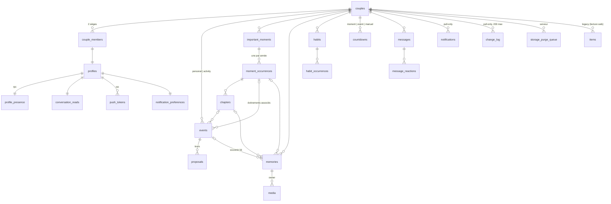

# 03 — Modèle de données

> Statut : **proposition à valider** (Phase 3 de la roadmap), **version 2** après relecture
> contradictoire. Rien n'est encore migré. Le schéma actuel (table unique `items`) reste
> en place et continue de servir le site web tant que les sections historiques ne sont
> pas portées.

## 1. Principes

1. **Une table par entité** pour tout ce qui est nouveau. Le modèle « tout est un item
   JSON » de la v1 interdit les index par période, l'intégrité référentielle, les règles
   RLS fines et les triggers temps réel ciblés.
2. **Un squelette commun et un mode de synchronisation déclaré par table** (§2, §3).
   Le moteur de synchronisation ne connaît que le squelette et le registre des modes :
   ajouter une entité = une table avec le squelette + une ligne dans le registre.
3. **Zéro duplication.** Une donnée vit à un seul endroit ; le reste est une relation ou
   un calcul (date d'une occurrence annuelle, libellé d'un compte à rebours, non-lus,
   statut d'une activité, compteur de l'accueil).
4. **Suppression douce partout** (`deleted_at`) avec **cascade explicite** (`deleted_via`)
   et purge à 30 jours (§13).
5. **Identifiants générés côté client** : UUID v4 pour les objets libres, **UUID v5
   dérivé de la clé naturelle** pour tout ce que les deux téléphones peuvent créer « en
   même temps » (§2.3). C'est ce qui rend le *dernier modifié gagne* suffisant sans
   moteur de conflits.
6. **Le serveur ne fait pas confiance au client** pour l'appartenance ni l'auteur :
   `couple_id`, `created_by`, `updated_by` sont forcés par trigger.
7. **Le domaine est typé une fois** (`packages/domain`, schémas zod) ; les lignes SQLite
   et Postgres en dérivent. Les invariants sont des `CHECK` Postgres **et** des règles
   zod identiques.

## 2. Squelette commun (`SyncedRow`)

| Colonne             | Type          | Rôle                                                                                                  |
| ------------------- | ------------- | ----------------------------------------------------------------------------------------------------- |
| `id`                | `uuid` PK     | Client. v4, ou v5 dérivé (§2.3).                                                                      |
| `couple_id`         | `uuid` FK     | Forcé par trigger à `auth_couple_id()`.                                                               |
| `created_at`        | `timestamptz` | Client (horloge locale corrigée, [04 §10](04-sync-offline.md)).                                       |
| `created_by`        | `uuid`        | Forcé par trigger à `auth.uid()` à l'insertion.                                                       |
| `updated_at`        | `timestamptz` | Client. **Arbitre du LWW** avec `updated_from`. Ramené à `now()` par le trigger s'il dépasse `now() + 2 min`. |
| `updated_by`        | `uuid`        | Forcé par trigger à `auth.uid()` (`null` pour une écriture serveur).                                   |
| `updated_from`      | `text`        | `device_id` de l'appareil auteur, ou `'server'` pour une écriture par trigger/fonction.               |
| `server_updated_at` | `timestamptz` | `clock_timestamp()` posé par le trigger à chaque écriture effective. **Curseur** de pull (avec `id`). |
| `deleted_at`        | `timestamptz` | `null` = vivant. Non null = corbeille.                                                                |
| `deleted_via`       | `uuid`        | `id` du parent dont la mise à la corbeille a entraîné celle-ci ; `null` si supprimé seul (§13).        |

### 2.1 Ordre total et trigger `sync_guard()`

Deux écritures sont ordonnées par le **couple** `(updated_at, updated_from)` — jamais par
`updated_at` seul, pour qu'une égalité d'horodatage ait toujours un gagnant, le même sur
tous les appareils.

Trigger `before insert or update` sur chaque table `lww` :

```sql
-- 1. appartenance et auteur : on ne fait pas confiance au client
if auth.uid() is not null then
  NEW.couple_id  := auth_couple_id();
  NEW.updated_by := auth.uid();
  if TG_OP = 'INSERT' then NEW.created_by := auth.uid(); end if;
end if;
-- 2. horloge du client en avance : on ramène
if NEW.updated_at > now() + interval '2 minutes' then NEW.updated_at := now(); end if;
-- 3. LWW : l'entrant doit être strictement plus récent, sinon rien ne se passe
if TG_OP = 'UPDATE'
   and (OLD.updated_at, OLD.updated_from) >= (NEW.updated_at, NEW.updated_from) then
  return null;               -- pas d'écriture, pas de broadcast, pas de change_log
end if;
-- 4. résurrection après purge : refusée (le client jettera son entrée d'outbox)
if TG_OP = 'INSERT' and NEW.created_at < now() - interval '30 days'
   and current_setting('nous.bypass_guard', true) is distinct from 'on' then
  raise exception 'resurrection refused' using errcode = 'P0030';
end if;
NEW.server_updated_at := clock_timestamp();
return NEW;
```

Conséquences pour le client ([04 §6](04-sync-offline.md)) : une ligne perdante n'apparaît
pas dans le `RETURNING` de l'upsert ; le push est donc un **accusé de réception**, et il
est **toujours suivi d'un pull** des mêmes tables qui rapporte la version gagnante. Un
réessai ou un écho porte un couple égal → `return null` → vrai no-op.

Les triggers `after` (broadcast temps réel, `change_log`) ne se déclenchent que sur une
écriture effective, et se taisent si `current_setting('nous.skip_broadcast', true) = 'on'`
(migrations, réparations). Toute écriture faite **par un trigger** sur une ligne
synchronisée pose `updated_from = 'server'`, `updated_by = null`, `updated_at = now()`.

### 2.2 `server_updated_at` n'est pas strictement monotone

`clock_timestamp()` est croissant dans une transaction, mais deux transactions
concurrentes peuvent committer dans l'ordre inverse. Le curseur de pull est donc un
**couple** `(server_updated_at, id)` avec une **fenêtre de recouvrement** de 60 s
([04 §7](04-sync-offline.md)) ; l'application étant idempotente, ré-appliquer ne coûte rien.

### 2.3 Identifiants dérivés (UUID v5)

Toute ligne identifiée par une **clé naturelle** reçoit `id = uuid_v5(NS_NOUS, clé)`,
calculé dans le domaine, identique sur tous les appareils. Deux téléphones qui « créent »
le même objet hors ligne produisent alors **la même ligne**, arbitrée par LWW, au lieu
d'une violation d'unicité.

| Table                      | Clé naturelle                              |
| -------------------------- | ------------------------------------------ |
| `moment_occurrences`       | `moment_id`, `year`                        |
| `chapters` (automatiques)  | `occurrence_id`, `auto_key`                |
| `habit_occurrences`        | `habit_id`, `scheduled_date`               |
| `proposals`                | `event_id`, `round`                        |
| `message_reactions`        | `message_id`, `user_id`, `emoji`           |
| `conversation_reads`       | `user_id`                                  |
| `notification_preferences` | `user_id`                                  |

Les index uniques correspondants restent en place comme filet, plus comme arbitre.

## 3. Registre des modes de synchronisation

| Mode          | Tables                                                                                                                                                                                  | Écriture client                                     | Pull                                    |
| ------------- | --------------------------------------------------------------------------------------------------------------------------------------------------------------------------------------- | --------------------------------------------------- | --------------------------------------- |
| `lww`         | `couples`, `profiles`, `events`, `proposals`, `important_moments`, `moment_occurrences`, `chapters`, `countdowns`, `memories`, `media`, `habits`, `habit_occurrences`, `messages`, `message_reactions`, `conversation_reads`, `notification_preferences` | outbox → upsert (`sync_guard`) | curseur `(server_updated_at, id)` par `couple_id` (ou `user_id` pour les tables personnelles) |
| `pull-only`   | `change_log`, `notifications`                                                                                                                                                           | aucune (`notifications.read_at` : update limité)     | curseur, jamais poussées                |
| `rpc`         | `push_tokens` (`register_push_token()`), `profile_presence` (`touch_presence()`)                                                                                                        | appel direct en ligne, réessai à l'ouverture        | lecture directe                         |
| `legacy`      | `items`                                                                                                                                                                                 | aucune depuis le mobile dans cette roadmap           | aucun (Q14)                             |
| local         | `outbox`, `sync_state`, `search_index` (base du compte), `kv` (`expo-sqlite/kv-store`, base de l'appareil)                                                                              | —                                                   | —                                       |

`packages/data/src/sync/registry.ts` reflète ce tableau, avec pour chaque table `lww`
l'**ordre de push** (parents avant enfants : `couples`, `profiles`, `events`,
`important_moments`, `moment_occurrences`, `chapters`, `habits`, `memories`, `media`,
`proposals`, `habit_occurrences`, `countdowns`, `messages`, `message_reactions`,
`conversation_reads`, `notification_preferences`).

## 4. Vue d'ensemble



## 5. Identités

### `couples` (`lww`)

| Colonne          | Type  | Notes                                                                 |
| ---------------- | ----- | --------------------------------------------------------------------- |
| `name`           | text  | « Nous » (ex-`siteName`).                                             |
| `tagline`        | text  |                                                                       |
| `cover_media_id` | uuid  | Référence souple → `media` (`owner_type = 'couple'`).                 |
| `palette`        | text  | `automne` \| `bleu`. Partagé (héritage de « la demande »).            |
| `legacy_space`   | text  | Valeur de `VITE_SPACE_ID` de la v1. Sert aux policies `items`/Storage.|
| `settings`       | jsonb | Petites préférences partagées non structurées (critères Airbnb…).     |
| + squelette      |       | `couple_id = id`.                                                     |

> La **date de début** de la relation n'est plus ici : c'est le moment important de type
> `anniversary` (§7), unique par couple. Le compteur de l'accueil le lit. Une seule
> source.

### `couple_members`

`(couple_id, seat smallint check (seat in (1, 2)))` PK, `user_id uuid unique` →
`auth.users`. Exactement deux sièges par couple, un compte n'appartient qu'à un couple.
`auth_couple_id()` = `select couple_id from couple_members where user_id = auth.uid()`
(`stable`, `security definer`). Lignes créées par l'étape `identity` du script de
migration (Phase 3), jamais par trigger sur `auth.users` (les inscriptions sont fermées).

### `profiles` (`lww`, mise à jour par son propriétaire seulement)

| Colonne           | Type  | Notes                                                                                   |
| ----------------- | ----- | --------------------------------------------------------------------------------------- |
| `id`              | uuid  | = `auth.users.id`.                                                                      |
| `display_name`    | text  | « Mimi ».                                                                               |
| `color`           | text  | Couleur d'avatar.                                                                       |
| `avatar_media_id` | uuid  | Référence souple → `media` (`owner_type = 'profile'`).                                  |
| `login`           | text  | Surnom de connexion (slug), informatif.                                                 |
| `preferences`     | jsonb | Copie synchronisée de `DisplayPreferences` (§5.1), l'original vit sur l'appareil (`kv`). |
| + squelette       |       | RLS : `select` couple, `update using (id = auth.uid())`.                                |

### `profile_presence` (`rpc`)

`user_id` PK, `last_seen_at timestamptz`. Écrite par `touch_presence()` (à l'ouverture,
au passage en arrière-plan, toutes les 5 min au premier plan) : **hors LWW, sans
broadcast ni `change_log`**, pour ne pas écraser le profil ni bruiter le canal. Lue par
le couple. La présence « En ligne » vient de Realtime Presence (§11).

### 5.1 `DisplayPreferences` (domaine, Phase 3)

```ts
{ density: 'compact'|'normal'|'airy', motionLevel: 'system'|'full'|'reduced'|'off',
  weekStartsOn: 1, defaultView: 'day'|'week'|'month'|'year', hourRange: [7, 23],
  visible: { partnerPersonalEvents, habits, memories, moments, countdowns, locations,
             categoryColors, presenceDetail, quickMessage },       // booléens
  statsHidden: boolean, haptics: boolean, effects: { grain: boolean } }
```

Stockées dans `kv` (par appareil), recopiées dans `profiles.preferences` (par personne).
Elles filtrent (« informations visibles ») et n'altèrent jamais couleurs, polices ni
formes.

## 6. Calendrier

### `events` (`lww`)

Une seule table pour les **événements personnels** et les **activités à deux**
(`kind`). Le domaine expose l'union `PersonalEvent | CoupleActivity`.

| Colonne          | Type        | Notes                                                                                                    |
| ---------------- | ----------- | -------------------------------------------------------------------------------------------------------- |
| `kind`           | text        | `personal` \| `activity`.                                                                                |
| `title`, `description` | text  |                                                                                                          |
| `all_day`        | boolean     |                                                                                                          |
| `start_at`, `end_at` | timestamptz | `null` = sans heure (bande du haut).                                                                |
| `tz`             | text        | Fuseau IANA de l'événement. **Heure murale** : « restaurant 20 h Europe/Paris » s'affiche 20 h partout ; la conversion vers l'appareil ne sert qu'aux notifications. |
| `start_date`, `end_date` | date | **Dérivées** par trigger de `start_at/end_at` dans `tz` quand ils existent ; saisies directement sinon (tout-la-journée, sans heure, multi-jours). Le domaine a un seul écrivain : `setWindow(event, window)`. |
| `location_name`, `location_lat`, `location_lng`, `location_city` | | Sous-type `Location` du domaine. |
| `category`       | text        | Catalogue fixe (`restaurant`, `voyage`, `ciné`, `maison`, `sport`, `famille`, `autre`…), libellés FR dans le domaine. |
| `color`          | text        | Optionnel.                                                                                               |
| `owner_id`       | uuid        | `personal` : la personne concernée ; `activity` : `null`.                                                |
| `cover_media_id` | uuid        | Référence souple → un média d'un souvenir lié.                                                           |
| `status`         | text        | `personal` : `confirmed`. `activity` : `proposed` \| `accepted` \| `declined` \| `cancelled` — **dérivé par trigger** du dernier tour de `proposals` ; jamais écrit par le client (le domaine le calcule pour l'aperçu). |
| `occurrence_id`  | uuid        | → `moment_occurrences` (`on delete set null`) : « événements associés » d'une occurrence.                 |
| `chapter_id`     | uuid        | → `chapters` (`on delete set null`) ; implique `occurrence_id` (trigger de cohérence).                    |
| `source_habit_occurrence_id` | uuid | Référence souple : créé par un « rattrapage ».                                                     |
| + squelette      |             |                                                                                                          |

`CHECK` (et zod identiques) : `end_at is null or end_at > start_at` ;
`(start_at is null) = (end_at is null)` ; `not all_day or start_at is null` ;
`end_date >= start_date` ; `(kind = 'personal') = (owner_id is not null)` ;
`kind <> 'personal' or status = 'confirmed'`.

### `proposals` (`lww`, `id = v5(event_id, round)`)

| Colonne        | Type        | Notes                                                                                       |
| -------------- | ----------- | ------------------------------------------------------------------------------------------- |
| `event_id`     | uuid FK     | `on delete cascade`.                                                                        |
| `round`        | int         | 1 = proposition initiale. La proposition **courante** = `max(round)` (pas d'index « une pending »). |
| `proposed_by`  | uuid        | Policy `insert with check (proposed_by = auth.uid())`.                                      |
| `snapshot`     | jsonb       | Champs proposés : `{ start_date, end_date, start_at, end_at, all_day, tz, location_*, title, description, category, duration_min }`. |
| `message`      | text        | Petit mot.                                                                                  |
| `status`       | text        | `pending` \| `accepted` \| `declined` \| `countered` \| `withdrawn`.                        |
| `responded_by`, `responded_at` | | Policy : répondre exige `responded_by = auth.uid() and proposed_by <> auth.uid()` ; retirer exige `proposed_by = auth.uid()`. |
| + squelette    |             |                                                                                             |

**Table de transitions** (états × actions × acteur) — les tests des Phases 3 (SQL) et 9
(TS) en dérivent :

| Depuis     | Action              | Acteur         | Vers                                              |
| ---------- | ------------------- | -------------- | ------------------------------------------------- |
| `pending`  | accepter            | l'autre        | `accepted` ; `events.status = accepted`, `events` ← `snapshot` |
| `pending`  | refuser             | l'autre        | `declined` ; `events.status = declined`            |
| `pending`  | contre-proposer     | l'autre        | `countered` + nouveau tour `pending` (round + 1)   |
| `pending`  | retirer             | l'auteur       | `withdrawn` ; `events.status = cancelled`          |
| `accepted` | modifier date/heure/lieu (Q3) | l'un | nouveau tour `pending` (round + 1) par celui qui modifie ; `events.status = proposed` |
| `accepted` | modifier le reste   | l'un           | pas de tour, `events` mis à jour                  |
| `declined` | 30 jours écoulés    | `purge_trash()`| `events.deleted_at` posé (corbeille, Q2)          |
| terminal (`accepted`, `declined`, `withdrawn`) | toute modification | — | **refusée** (trigger : `NEW := OLD`) |
| tour N     | insertion           | —              | refusée si le tour N−1 n'est pas `countered` (trigger) |

### 6.1 Ce qui reste des règles LWW ici

Ces gardes serveur sont les **seules exceptions** documentées au « pas de système
complexe » : elles protègent une machine d'états qu'un LWW ligne entière écraserait
(accepter puis, hors ligne, contre-proposer un tour déjà accepté).

## 7. Moments importants

### `important_moments` (`lww`)

| Colonne          | Type    | Notes                                                                                        |
| ---------------- | ------- | -------------------------------------------------------------------------------------------- |
| `kind`           | text    | `anniversary` \| `first_meeting` \| `first_date` \| `valentine` \| `custom`. Index unique partiel `(couple_id) where kind = 'anniversary' and deleted_at is null`. |
| `title`, `emoji`, `color`, `description` | | `color` par défaut `gold` ; `emoji` optionnel (étoile de la constellation). |
| `origin_date`    | date    |                                                                                              |
| `recurs_yearly`  | boolean | `true` par défaut.                                                                           |
| `feb29_rule`     | text    | `before` \| `after`.                                                                         |
| `reminder_days`  | int[]   | `{7, 1}` par défaut — **les rappels appartiennent à la date** (brief), pas au compte à rebours. |
| `reminder_time`  | time    | `09:00` par défaut.                                                                          |
| `cover_media_id` | uuid    | Référence souple (média `couple` ou d'un souvenir lié).                                       |
| `location_*`     |         | Lieu d'origine.                                                                              |
| + squelette      |         |                                                                                              |

Pas de colonne `sort` : la constellation est ordonnée par date.

### `moment_occurrences` (`lww`, `id = v5(moment_id, year)`)

| Colonne          | Type    | Notes                                                                        |
| ---------------- | ------- | ---------------------------------------------------------------------------- |
| `moment_id`      | uuid FK | `on delete cascade`.                                                         |
| `year`           | int     | Unique avec `moment_id` (filet).                                             |
| `title`, `text`  | text    | `title` null = calculé.                                                      |
| `location_*`     |         |                                                                              |
| `cover_media_id` | uuid    | Référence souple.                                                            |
| `mood`           | text    | Clé du catalogue `mood.*` du design system (`aube`, `jour`, `soir`, `nuit`, `neige`, `été`, `automne`, `printemps`). |
| + squelette      |         |                                                                              |

La date d'une occurrence est **calculée** (`occurrenceDate(moment, year)`, règle du 29
février incluse). Les lignes sont créées à la première édition ; les années sans ligne
s'affichent en « vide ».

### `chapters` (`lww`, `id = v5(occurrence_id, auto_key)` pour les automatiques, v4 sinon)

| Colonne          | Type        | Notes                                                                                    |
| ---------------- | ----------- | ---------------------------------------------------------------------------------------- |
| `occurrence_id`  | uuid FK     | `on delete cascade`.                                                                     |
| `title`          | text        |                                                                                          |
| `sort`           | int         | Déplaçable.                                                                              |
| `auto_key`       | text        | `before` \| `day` \| `evening` \| `after` \| `null`.                                     |
| `text`, `mood`, `cover_media_id` | |                                                                                  |
| `starts_at`, `ends_at` | timestamptz | **Seulement pour les chapitres manuels** ; les automatiques sont calculés à la lecture par `defaultChapters(occurrenceDate)` (bornes Q4). |
| + squelette      |             |                                                                                          |

Trigger de cohérence (sur `events` et `memories`) : si `chapter_id` et `occurrence_id`
sont posés, `chapter.occurrence_id = occurrence_id`.

### `countdowns` (`lww`)

| Colonne          | Type    | Notes                                                                                             |
| ---------------- | ------- | ------------------------------------------------------------------------------------------------- |
| `target_type`    | text    | `moment` \| `event` \| `manual`.                                                                  |
| `target_id`      | uuid    | Référence souple ; `null` si `manual`. Un compte à rebours dont la cible disparaît est nettoyé par `purge_trash()`. |
| `manual_title`, `manual_date` | | Seulement si `manual`.                                                                    |
| `emoji`, `cover_media_id` | |                                                                                                |
| `format`         | text    | `dodos` \| `days`.                                                                                |
| `reminder_days`, `reminder_time` | | **Seulement** pour `event`/`manual` (`check` : null si `moment` — le moment porte les siens). |
| + squelette      |         |                                                                                                   |

L'**épinglage widget** n'est pas une donnée du couple : il vit par appareil et par
instance de widget dans `kv` (`widget:{instanceId} → 'next' | { type, id }`).

## 8. Souvenirs et médias

### `memories` (`lww`)

| Colonne          | Type | Notes                                                              |
| ---------------- | ---- | ------------------------------------------------------------------ |
| `title`, `text`  | text |                                                                    |
| `date`           | date | Place le souvenir dans le calendrier.                              |
| `time`           | time | Optionnelle (bloc d'un créneau dans la grille si présente).        |
| `location_*`     |      |                                                                    |
| `event_id`       | uuid | → `events` `on delete set null`.                                   |
| `occurrence_id`  | uuid | → `moment_occurrences` `on delete set null`.                       |
| `chapter_id`     | uuid | → `chapters` `on delete set null` ; implique `occurrence_id`.       |
| `cover_media_id` | uuid | Référence souple vers un de ses médias.                            |
| + squelette      |      |                                                                    |

### `media` (`lww`)

**Un média appartient à un souvenir** (ou au couple pour la galerie pure, au profil pour
l'avatar, ou est un héritage v1). « Ajouter des photos à un événement / une occurrence /
un chapitre » = créer ou réutiliser **le souvenir lié** — c'est « création depuis un
événement » du brief. Une seule règle, un seul chemin de code, une seule définition de
« photo de la sortie ».

| Colonne          | Type    | Notes                                                                                                                  |
| ---------------- | ------- | ---------------------------------------------------------------------------------------------------------------------- |
| `kind`           | text    | `photo` \| `video`.                                                                                                    |
| `owner_type`     | text    | `memory` \| `couple` \| `profile` \| `legacy`.                                                                          |
| `owner_id`       | uuid    | `null` si `legacy`.                                                                                                     |
| `legacy_ref`     | text    | `collection/id/champ[i]` de la v1 (les `items.id` ne sont pas des uuid).                                                |
| `storage_path`   | text    | Clé d'objet complète telle quelle (v1 : `{legacy_space}/{uuid}.ext` ; nouveau : `{couple_id}/{id}.ext`). Trigger : `coalesce(NEW.storage_path, OLD.storage_path)` — jamais effacé par un LWW ligne entière. |
| `thumb_path`     | text    | Idem.                                                                                                                  |
| `width`, `height`, `duration_ms`, `bytes` | | |
| `taken_at`       | timestamptz | EXIF, sinon ajout.                                                                                                |
| `in_gallery`     | boolean | « Ajouter à la Galerie ».                                                                                              |
| `sort`           | int     |                                                                                                                        |
| + squelette      |         |                                                                                                                        |

Colonnes **locales seulement** (SQLite) : `local_uri`, `local_thumb_uri`, `upload_status`
(`pending` \| `uploading` \| `uploaded` \| `failed`), `upload_state` (URL de reprise TUS).
**La ligne n'entre dans l'outbox qu'une fois `uploaded`** ([04 §9](04-sync-offline.md)).

Les `cover_media_id` sont des **références souples** (pas de FK) : un souvenir peut
partir avant que sa photo soit envoyée ; l'affichage a un repli.

## 9. Habitudes

### `habits` (`lww`)

| Colonne        | Type    | Notes                                                                       |
| -------------- | ------- | --------------------------------------------------------------------------- |
| `title`, `emoji`, `color` | |                                                                          |
| `rule`         | jsonb   | `RecurrenceRule` (§9.1).                                                    |
| `start_date`, `end_date` | date |                                                                       |
| `time_of_day`  | time    | `null` = journée entière (relance le soir, heure de préférence).            |
| `duration_min` | int     |                                                                             |
| `paused_at`    | timestamptz |                                                                         |
| `reminder`     | jsonb   | `{ before_min: 30, ask_after_min: 60 }`.                                    |
| + squelette    |         |                                                                             |

#### 9.1 `RecurrenceRule`

```ts
type RecurrenceRule =
  | { freq: 'daily';   interval: number }
  | { freq: 'weekly';  interval: number; byWeekday: Weekday[] }
  | { freq: 'monthly'; interval: number; byMonthDay: number[] }              // -1 = dernier jour
  | { freq: 'monthly'; interval: number; byWeekdayPos: { weekday: Weekday; pos: 1|2|3|4|-1 }[] }
  | { freq: 'yearly';  interval: number; byMonth: number[]; byMonthDay: number[] }
```

Moteur maison, dates civiles, écrit en **Phase 3** (consommé par le calendrier dès la
Phase 7), voir ADR-004.

### `habit_occurrences` (`lww`, `id = v5(habit_id, scheduled_date)`)

| Colonne          | Type        | Notes                                                                 |
| ---------------- | ----------- | --------------------------------------------------------------------- |
| `habit_id`       | uuid FK     | `on delete cascade`.                                                  |
| `scheduled_date` | date        | Unique avec `habit_id` (filet).                                       |
| `status`         | text        | `pending` \| `done` \| `missed` \| `skipped`.                         |
| `done_at`, `done_by` | | Policy : `status <> 'done' or done_by = auth.uid()`.                            |
| `caught_up`, `caught_up_at` | | « Rattraper » : date + heure choisies ; crée un événement lié (Q8). |
| `note`           | text        |                                                                       |
| + squelette      |             |                                                                       |

**« Un seul des deux suffit »** : `done` est **absorbant**. Trigger : `if OLD.status =
'done' and NEW.status <> 'done' then NEW := OLD`. Le domaine n'émet jamais `missed` ni
`skipped` par-dessus un `done` connu. Le premier « oui » gagne quel que soit l'ordre
d'arrivée (deuxième et dernière exception aux règles LWW, avec §6.1).

## 10. Messagerie

### `messages` (`lww`, immuable)

| Colonne      | Type   | Notes                                                                                          |
| ------------ | ------ | ---------------------------------------------------------------------------------------------- |
| `sender_id`  | uuid   | Policy `insert with check (sender_id = auth.uid())`.                                           |
| `body`       | text   |                                                                                                |
| `client_seq` | bigint | Ordre stable par appareil en attendant `server_updated_at`.                                    |
| + squelette  |        | Trigger d'insertion : `created_at := now()` (heure **serveur**). Policy `update using (sender_id = auth.uid())` + trigger : seule `deleted_at` peut changer, et seulement si `now() < created_at + 5 min`. |

La suppression est donc l'**upsert normal** avec `deleted_at` (hors ligne compris) ; un
réessai est un no-op (§2.1). Pas de fonction RPC.

### `message_reactions` (`lww`, `id = v5(message_id, user_id, emoji)`)

`message_id` FK `on delete cascade`, `user_id`, `emoji`, + squelette. Unique
`(message_id, user_id, emoji)` (filet). Poser = upsert, retirer = `deleted_at`. RLS :
lecture par le couple, écriture `user_id = auth.uid()`.

### `conversation_reads` (`lww`, `id = v5(user_id)`)

`user_id`, `last_read_at`, + squelette (`couple_id` inclus : se synchronise entre mes
propres appareils). Non-lus = calculés. RLS : lecture couple, écriture propriétaire.

## 11. Présence

Aucune table pour « en ligne » : Realtime Presence sur le canal privé `couple:{id}`
(`{ user_id, device_id, screen, doing, at }`, toutes les 30 s et à chaque changement
d'écran). « En ligne » = présence < 90 s ; « Actif il y a X min » = `profile_presence` ;
« Hors ligne » sinon. Les bulles éphémères sont dérivées des changements reçus
(`updated_by ≠ moi`, < 30 s), jamais stockées.

## 12. Notifications

### `push_tokens` (`rpc`)

`(user_id, device_id)` PK, `token`, `platform`, `reminders_here boolean` (un seul appareil
élu pour les rappels locaux, index unique partiel), `updated_at`. Écrite par
`register_push_token()`.

### `notification_preferences` (`lww`, `id = v5(user_id)`)

`messages`, `proposals`, `habits`, `moments`, `quick_message` (booléens), `quiet_hours
{from, to}`, + squelette. RLS propriétaire.

### `notifications` (`pull-only`)

`recipient_id`, `kind`, `title`, `body`, `data` (lien profond), `scheduled_for`, `sent_at`,
`read_at`, + squelette (`couple_id`, `server_updated_at`). **Insérées uniquement par
triggers serveur** (Phase 15) : le client ne les crée jamais ; il tire les siennes
(`recipient_id = auth.uid()`) et ne peut modifier que `read_at`. Purge locale et serveur
à 30 jours.

## 13. Historique, corbeille, purge

### `change_log` (`pull-only`)

`id`, `couple_id`, `entity_type`, `entity_id`, `action`, `actor_id` (= `auth.uid()` du
trigger), `summary` jsonb, `at`, `server_updated_at`. Rempli par trigger `after` sur
`events`, `important_moments`, `moment_occurrences`, `chapters`, `memories`, `habits`,
`countdowns`. Plafonné à **200 lignes par couple** et **20 par entité** ; le client
applique le même plafond localement (les suppressions physiques serveur ne produisent
pas de tombstone, le plafond local suffit).

### Cascade de corbeille (domaine, une transaction)

| Relation                                  | Action FK Postgres      | À la mise à la corbeille du parent                     |
| ----------------------------------------- | ----------------------- | ------------------------------------------------------ |
| `proposals.event_id`                      | `on delete cascade`     | enfants → `deleted_at = parent.deleted_at`, `deleted_via = parent.id` |
| `moment_occurrences.moment_id`            | `on delete cascade`     | idem                                                   |
| `chapters.occurrence_id`                  | `on delete cascade`     | idem                                                   |
| `habit_occurrences.habit_id`              | `on delete cascade`     | idem                                                   |
| `message_reactions.message_id`            | `on delete cascade`     | idem                                                   |
| `media` (owner `memory`)                  | souple                  | idem                                                   |
| `memories.event_id / occurrence_id / chapter_id`, `events.occurrence_id / chapter_id` | `on delete set null` | rien (le souvenir survit, délié) |
| `*cover_media_id`, `avatar_media_id`, `source_habit_occurrence_id`, `countdowns.target_id` | souple | rien ; nettoyage à la purge |

**Restaurer** ne remet à `null` que les enfants dont `deleted_via = parent.id` : un enfant
supprimé seul auparavant reste en corbeille.

### `purge_trash()` et `storage_purge_queue`

Fonction SQL `security definer`, idempotente, **planifiée par `pg_cron`** (disponible sur
tous les plans Supabase, gratuit compris : `cron.schedule('purge-trash', '0 4 * * *',
$$select public.purge_trash_all()$$)` puis `net.http_post` vers la fonction Edge
`purge-trash`, secrets dans Vault) **et** appelée par l'application à l'ouverture comme
filet, bornée au couple de l'appelant (un projet en pause n'exécute pas ses jobs) :

1. `events` `activity` en `declined` depuis > 30 jours → `deleted_at` (Q2) ;
2. enfants d'abord, parents ensuite : suppression physique des lignes `deleted_at < now() − 30 days` ;
3. `countdowns` sans cible, `media` orphelins (propriétaire absent) → corbeille ;
4. chemins Storage des `media` purgés → `storage_purge_queue(path pk, couple_id, enqueued_at)` (aucune policy client) ;
5. l'app appelle ensuite la fonction Edge `purge-trash` (JWT utilisateur ; la fonction
   utilise la clé service pour `storage.remove` par lots et vider la file).

Le client applique la **même règle localement** (lignes `deleted_at < 30 j`, fichiers,
entrées d'outbox) : la corbeille locale suit la purge serveur ([04 §11](04-sync-offline.md)).

## 14. Sections historiques (`items`)

`items` **n'est pas synchronisée par le mobile** dans cette roadmap (Q14) : le web v1
supprime physiquement et ne connaît ni `deleted_at` ni `couple_id`. La migration
`0010_legacy_items.sql` se limite à : policy `space = (select legacy_space from couples
where id = auth_couple_id())` (ferme D5 pour les données v1 dès la Phase 3, sans changer
le web) et index. Le portage d'une section v1 commencera par une vraie migration de
données vers une table dédiée.

## 15. Sécurité (RLS)

- Tables `lww` du couple : `using (couple_id = auth_couple_id())` en lecture et écriture ;
  `couple_id`, `created_by`, `updated_by` forcés par `sync_guard()`.
- Tables personnelles (`profiles`, `conversation_reads`, `notification_preferences`,
  `message_reactions`) : lecture couple, écriture `user_id = auth.uid()` (ou `id`).
- `proposals`, `habit_occurrences` : policies d'acteur (§6, §9).
- `messages` : insertion propre, mise à jour limitée à `deleted_at` sous 5 min.
- `notifications`, `change_log` : lecture seule (`recipient_id = auth.uid()` /
  `couple_id`), `read_at` modifiable.
- Storage : bucket `media` privé ; `using` et `with check` :
  `bucket_id = 'media' and (storage.foldername(name))[1] in (auth_couple_id()::text,
  (select legacy_space from couples where id = auth_couple_id()))` — les photos v1
  restent lisibles, le web v1 continue d'écrire.
- Realtime : canal `couple:{id}` **privé** ; policies sur `realtime.messages` en
  [04 §8](04-sync-offline.md).
- Inscriptions fermées ; `auth_couple_id()` renvoie `null` pour un compte sans siège →
  aucune ligne visible.

## 16. Index

Sur chaque table `lww` : `(couple_id, server_updated_at, id)`. Puis :
`events (couple_id, start_date, end_date) where deleted_at is null`,
`events (couple_id, occurrence_id)`, `memories (couple_id, date) where deleted_at is null`,
`memories (occurrence_id)`, `media (owner_type, owner_id, sort)`,
`media (couple_id, taken_at desc) where in_gallery and deleted_at is null`,
`messages (couple_id, created_at desc)`, `notifications (recipient_id, scheduled_for)
where sent_at is null`, `change_log (entity_type, entity_id, at desc)`,
`change_log (couple_id, at desc)`, et un index partiel corbeille `(couple_id, deleted_at)
where deleted_at is not null` sur chaque table listée dans l'écran Corbeille. Les mêmes
index existent dans le schéma Drizzle SQLite (c'est là que tournent les vues).

## 17. Livrables de la Phase 3

| Livrable                                                     | Emplacement                              |
| ------------------------------------------------------------ | ---------------------------------------- |
| Types + zod (17 entités, `DisplayPreferences`, `Location`)   | `packages/domain/src/entities/*.ts`      |
| Moteur de récurrence, `occurrenceDate`, `defaultChapters`, ids v5 | `packages/domain/src/{recurrence,moments,ids}/` |
| Interfaces de repositories (signatures en [02 §2](02-architecture.md)) | `packages/domain/src/repositories/*.ts` |
| Migrations `0001` … `0010` (tables, `sync_guard`, gardes, broadcast, RLS, index, `purge_trash`) | `supabase/migrations/`     |
| Tests pgTAP sur instance locale                              | `supabase/tests/*.sql`                   |
| Schéma SQLite miroir + colonnes locales                      | `packages/data/src/schema/*.ts`          |
| Script `migrate-v1.ts` : étapes `identity` (appliquée en Phase 3), `moments` (10), `media-legacy` (11) | `supabase/scripts/`  |
| Seed : deux couples, quatre comptes                          | `supabase/seed/dev.sql`                  |
