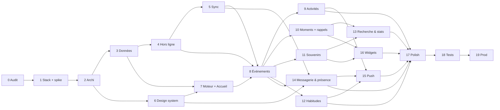

# Nous — Roadmap technique du calendrier mobile

> **Statut : proposition, en attente de validation — version 2** après relecture
> contradictoire (sept lentilles, réfutations, synthèse). Aucune ligne de code applicatif
> n'est écrite tant que les Phases 0 à 3 ne sont pas validées. Ce document est le
> contrat : un autre développeur doit pouvoir reprendre le projet à n'importe quelle
> phase avec lui seul.
>
> Documents liés : [00 Audit](00-audit.md) · [01 Stack](01-stack.md) ·
> [02 Architecture](02-architecture.md) · [03 Modèle de données](03-modele-de-donnees.md) ·
> [04 Sync & hors ligne](04-sync-offline.md) · [05 Design system](05-design-system-mobile.md) ·
> [06 Moteur calendrier](06-moteur-calendrier.md) · [07 Questions ouvertes](07-questions-ouvertes.md) ·
> [ADR](adr/)

## 0. Lecture rapide

Le tableau donne les **dépendances directes** ; le graphe en est dérivé (en cas d'écart,
le tableau fait foi). **Ordre linéaire recommandé** pour un développeur seul :
2 · 3 · 6 · 4 · 5 · 7 · 8 · 9 · 10 · 12 · 11 · 13 · 14 · 15 · 16 · 17 · 18 · 19.

| Phase | Titre                                  | Dépend de   | Livrable vérifiable                                                                     |
| ----- | -------------------------------------- | ----------- | --------------------------------------------------------------------------------------- |
| 0     | Audit                                  | —           | `docs/00-audit.md` ✅                                                                    |
| 1     | Stack mobile et spike                  | 0           | `docs/01-stack.md`, ADR-001, **spike de la vue Semaine sur les deux téléphones** (Expo Go), mesures, ADR-009 zéro dépense — **validation attendue** |
| 2     | Architecture & monorepo                | 1           | Monorepo pnpm, app Expo connectée à Supabase sur les deux téléphones, web non régressé, CI, `ping()` anti-pause, `backup.yml` |
| 3     | Modèle de données & repositories       | 2           | Migrations sur instance locale puis projet réel, identité du couple installée, moteur de récurrence, repositories testés en Node |
| 4     | Stockage local & hors ligne            | 3           | Base par compte, outbox, curseurs transactionnels, FTS ; CRUD complet en mode avion       |
| 5     | Synchronisation temps réel             | 4           | Registre de modes, push/pull/LWW/canal privé ; convergence 3/3 au protocole deux téléphones |
| 6     | Design system mobile                   | 2           | `packages/theme`, `ui/*`, galerie + **quatre maquettes vivantes validées par le couple**  |
| 7     | Moteur calendrier & Accueil            | 3, 6        | Vues Accueil / Jour / Semaine / Mois / Année, gestes arbitrés, données de démonstration  |
| 8     | Événements personnels                  | 4, 5, 7     | Créer / éditer / déplacer / supprimer / restaurer, hors ligne et sur l'autre téléphone   |
| 9     | Activités à deux & propositions        | 8           | Bulle : accepter / refuser / contre-proposer / retirer ; gardes serveur                   |
| 10    | Moments importants, chapitres, comptes à rebours, rappels locaux | 8 | Constellation, occurrences, chapitres, « Encore 24 dodos », planificateur local |
| 11    | Souvenirs & médias                     | 8           | Photos et vidéos courtes hors ligne (upload standard, reprise applicative, vignettes), galerie unifiée v1 + nouveaux, purge Storage |
| 12    | Habitudes                              | 8           | « Tous les [3] [semaines] », fait / pas fait / rattraper, relance                        |
| 13    | Recherche & statistiques               | 10, 11      | Périodes naturelles, personnes, contenu associé ; « Nos statistiques » masquable         |
| 14    | Messagerie & présence                  | 5, 6, 8     | Conversation, réactions hors ligne, présence partout, bulles d'activité, message rapide  |
| 15    | Notifications push                     | 9, 12, 14   | Triggers → Edge Function → Expo Push ; préférences ; liens profonds                       |
| 16    | Widgets Android (iOS hors périmètre)   | 10, 11      | Widget photo + compte à rebours, 3 tailles, juste à minuit sans ouvrir l'app             |
| 17    | Polish UX, réglages, onboarding        | 9, 12, 13, 14, 15, 16 | Réglages complets (affichage, présence, notifications…), reduced-motion, a11y |
| 18    | Tests complets                         | 17          | E2E, chaos par proxy, charge, VoiceOver / TalkBack, couverture                           |
| 19    | Optimisation & production              | 18          | Builds EAS, distribution privée, durcissement Supabase, sauvegardes, runbook              |



## 1. Règles de conduite (valables pour toutes les phases)

1. **À chaque phase** : expliquer ce qui va être fait → lister les fichiers → implémenter →
   tester → corriger → vérifier l'architecture (règle de dépendance des couches, taille
   des fichiers, absence de logique métier dans l'UI) → seulement ensuite passer à la
   suivante. Une phase se termine par une PR nommée `phase-N-…` avec sa *définition de
   fini* cochée — **chaque phase en a une, mesurable**.
2. **Définition de fini commune** : typecheck, lint, tests verts ; `apps/web` se construit
   encore ; `expo doctor` vert ; aucun `any` ; aucun `TODO` sans ticket ; composants
   < 200 lignes sauf justification ; décision non évidente → ADR ou commentaire « pourquoi ».
3. **Rien n'est supprimé du web** avant que le mobile ne soit en production.
4. **La logique métier vit dans `packages/domain`**, testée en Node.
5. **Migrations serveur additives** jusqu'à la Phase 19 ; le contrat `items(collection,
   data)` lu par le web n'est jamais altéré.
6. **Deux téléphones réels** (modèles fixés en Phase 1, T10/T13). **Android est la plateforme
   principale** ; si l'un des deux a un iPhone, son client est la **PWA** à périmètre réduit
   (ADR-009, [09](09-zero-depense.md), §7). La Phase 4 est vérifiée en mode avion ; chaque
   phase ≥ 5 est vérifiée sur les deux téléphones, en mode avion puis en ligne, au
   **protocole deux téléphones** de la Phase 5 — **Android automatisé (Maestro), PWA iPhone
   par check-list manuelle** (`maestro/MANUAL-IOS.md`) : Maestro ne pilote pas d'iPhone physique.
7. **Zéro dépense** (ADR-009) : aucun compte Apple, Play Console, plan Supabase ou EAS
   payant. Les builds Android sont **locaux (Linux/WSL2) ou en CI GitHub Actions**, avec un
   seul keystore sauvegardé ; EAS Build n'est qu'un secours, EAS Update un confort. Un build
   de développement n'est refait que lorsqu'une dépendance native change ; le JavaScript
   passe par le serveur de développement ou EAS Update. Aucun secret dans le dépôt (public).
8. **L'usage réel par le couple** (« une semaine sans perte ») est un *soak* en parallèle,
   jamais le critère bloquant : le critère est le scénario automatisé (ou la check-list
   iOS jouée et signée).

## 2. Structure cible du dépôt

```
nous/
├─ apps/
│  ├─ web/                        site v1 (déplacé tel quel, gelé — ADR-002)
│  └─ mobile/
│     ├─ app/                     routes Expo Router (carte en 02 §2)
│     ├─ src/
│     │  ├─ ui/                   design system mobile (05), dont ui/motion/*
│     │  ├─ providers/            Theme, Motion, Session, Data, Sync, Presence, Notifications
│     │  ├─ features/
│     │  │  ├─ home/  calendar/ (+ gestures/)  events/  proposals/  moments/  countdowns/
│     │  │  ├─ memories/  habits/  messages/  presence/  search/  stats/
│     │  │  └─ settings/  trash/  onboarding/  auth/
│     │  └─ native/               WidgetBridge, App Group, snapshot
│     ├─ widgets/                 ios/ (expo-widgets ou targets Swift)  android/
│     ├─ assets/                  polices, tuile de grain, icône, splash
│     ├─ maestro/  scripts/two-phones.sh
│     ├─ app.config.ts  eas.json
├─ packages/
│  ├─ domain/                     entités, ids, moteurs, interfaces, services (TS pur)
│  ├─ data/                       SQLite, outbox, sync (registry), realtime, médias, auth, presence, push
│  ├─ theme/                      tokens.ts → tokens.css + createTheme + contrastes
│  └─ icons/
├─ supabase/
│  ├─ migrations/  functions/{push,purge-trash}/  tests/ (pgTAP)  scripts/migrate-v1.ts  seed/
├─ docs/
├─ .github/workflows/ci.yml  backup.yml  release-android.yml
├─ pnpm-workspace.yaml  package.json  tsconfig.base.json  .eslintrc.cjs  .prettierrc
```

## 3. Les phases

---

### Phase 0 — Audit ✅

Fait : [00-audit.md](00-audit.md). Dix-neuf dettes avec preuves, contre-lues ; inventaire
du réutilisable.

---

### Phase 1 — Choix de la stack, spike, prérequis

**Objectif.** Trancher, justifier, **prouver sur les téléphones du couple** que le point le
plus risqué de la stack tient, et lever les prérequis. **Point de validation.**

**Livrables.**

- [01-stack.md](01-stack.md) (comparatif, contre-expertise, verdict), [ADR-001](adr/ADR-001-stack-react-native-expo.md).
  Réponses aux questions T1–T11 de [07](07-questions-ouvertes.md).
- **Prérequis** (révisés le 06/09, zéro dépense) : **aucun compte payant**. Téléphones de
  test identifiés (modèles, OS, 60/120 Hz, lequel est un iPhone — T10, T13), compte Expo
  gratuit et Expo Go installé sur les deux téléphones, projet Supabase réactivé, réponses
  aux questions de [09 §11](09-zero-depense.md).
- **Mesures sur les données réelles** : `items` par collection (nombre, taille),
  objets Storage et orphelins (`storage.objects` vs références `cloud:` dans les dix
  champs de `items.data`), `local:` restants, échelle réelle de `Adventure.rating`,
  réglage « Max rows » de l'API (≥ 1000), mode réellement utilisé par le couple
  (`VITE_SUPABASE_*` du déploiement). Ces chiffres dimensionnent la migration et le plan
  Supabase (T9).
- **Deux spikes — la porte de décision** ([01 §6](01-stack.md)), un par client, parce que
  les deux téléphones ne recevront pas le même : vue Semaine 48 créneaux × 7 jours,
  long-press 350 ms → soulèvement → accrochage 30 min → poignées → pinch de hauteur de
  créneau, scroll qui ne se bat pas avec le drag, colonne focus en portrait
  ([06 §3.7, §4](06-moteur-calendrier.md)), plus un écran de messagerie factice pour le
  clavier.
  - [`spike/week-grid`](../spike/week-grid/README.md) — **React Native**, jeté ensuite,
    lancé via **Expo Go** (gratuit, sans compte Apple) ; mesure de référence sur un build
    release local sur le **S24 Ultra**.
  - [`spike/week-grid-web`](../spike/week-grid-web/README.md) — **web**, même logique de
    domaine, gestes en pointer events ; c'est le futur client de l'**iPhone 16**, donc ce
    code-là ne sera pas jeté mais repris par `apps/web`. Son onglet **Mesures** répond en
    plus aux inconnues de [09 §10](09-zero-depense.md) : fréquence d'écran, quota de
    stockage, notification sans serveur, badge, hors ligne.

  **Critères** : 0 frame au-delà du **budget de l'écran mesuré par le spike** (≈ 8,3 ms à
  120 Hz sur le S24 Ultra, 16,7 ms à 60 Hz sur l'iPhone 16 — le compteur affiche le budget
  qu'il a mesuré), 0 geste perdu sur 50 essais, aucun menu contextuel iOS à l'appui long,
  la page qui ne zoome pas au pincement, clavier sans saut, et le verdict du couple sur
  **chacun des deux clients** : « ça sent l'app » ou « ça sent le site ».

**Fini quand** : stack validée par écrit après le spike ; appareils identifiés (dont la
réponse iPhone / pas d'iPhone) ; projet Supabase joignable ; les deux `auth.uid()` connus ;
volumes mesurés ; ADR-009 accepté par le couple.

**Effort.** 10–12 jours (dont le spike).

**État au 07/09/2026.** Appareils connus (T10, T13) : **Galaxy S24 Ultra** et **iPhone 16**,
donc le **cas B** d'ADR-009 — la variante iPhone (§7) s'applique et le spike web existe
(`spike/week-grid-web`, typé, testé, publié). Reste : lancer les deux spikes sur les deux
téléphones et écrire les deux verdicts.

**État au 06/09/2026.** Stack tranchée sur dossier ([01](01-stack.md), ADR-001) ; projet
Supabase restauré et données réelles mesurées ([08](08-mesures-phase1.md) : 10 lignes,
4,4 Ko, 2 photos, les deux `auth.uid()` relevés) ; spike écrit et typé dans
[`spike/week-grid/`](../spike/week-grid/README.md) (palette bleue et couleurs réelles du
couple). **Reste** : appareils (T10, T13), réponses de [09 §11](09-zero-depense.md), lancement du
spike via Expo Go sur les deux téléphones et leur verdict — la porte de décision n'est pas
franchie tant que ce verdict n'est pas écrit dans l'ADR-001. Le 06/09 au soir, la contrainte
« zéro dépense » a été instruite ([09](09-zero-depense.md), ADR-009) : plus aucun prérequis
payant.

---

### Phase 2 — Architecture générale et monorepo

**Objectif.** Poser la coquille sans fonctionnalité, en prouvant que le web ne régresse
pas, et que l'app se connecte à Supabase sur les deux téléphones.

**Fichiers.**

- `pnpm-workspace.yaml`, `package.json` racine, `tsconfig.base.json` (strict +
  `noUncheckedIndexedAccess` + `exactOptionalPropertyTypes`), **`apps/web/tsconfig.json`
  étend la base mais désactive ces deux options** (site gelé — sinon `Settings.tsx:357`
  ne compile plus), `.eslintrc.cjs` (typescript-eslint, react-hooks,
  `import/no-restricted-paths`, règle motion), `.prettierrc`,
  `.github/workflows/{ci,backup,release-android}.yml` (CI ; sauvegarde hebdomadaire chiffrée
  qui touche la base ; APK release arm64-v8a signé, publié en GitHub Release).
- `apps/web/**` ← `git mv` ; `supabase/legacy/{schema,auth}.sql`.
- `apps/mobile/` ← `create-expo-app` avec **`expo@^57.0.17`** (RN ≥ 0.86.3 : les versions
  antérieures portent une régression Hermes qui rend le démarrage des builds de
  développement 20 à 100 fois plus lent — expo #48298, corrigé par RN 0.86.3), Expo Router, TypeScript ; `app.config.ts` (scheme `nous`,
  bundle ids, plugins, lecture de `EXPO_PUBLIC_SUPABASE_URL` /
  `EXPO_PUBLIC_SUPABASE_ANON_KEY` par profil), `eas.json` (`development` / `preview` /
  `production`) ; `.npmrc` racine `node-linker=hoisted` ; `pnpm.overrides` garantissant
  une seule copie de `react`, `react-native`, `react-native-reanimated`,
  `react-native-worklets`, `react-native-nitro-modules` ; assertion de version en CI.
- `packages/domain/src/{dates,utils}/` ← extraction et **correction** de `lib/date.ts`
  (D7, D8) et `lib/utils.ts`, tests de caractérisation avant, tests après.
- `packages/data/src/supabase/client.ts` (client RN : storage de session injecté,
  `AppState` → `auth.startAutoRefresh()` / `stopAutoRefresh()` comme l'exige la doc
  Supabase pour React Native), `packages/data/src/auth/{nickname.ts,session.ts,AuthClient.ts,LargeSecureStore.ts}`
  (clé AES-256 générée par `expo-crypto` et gardée dans `expo-secure-store`, session
  chiffrée stockée dans `expo-sqlite/kv-store` — SecureStore plafonne à 2 Ko par valeur).
- `packages/theme/src/tokens.ts` + `scripts/generate-css.ts` + **test de parité** (parse
  postcss de l'ancien et du nouveau `tokens.css`, égalité des propriétés par palette ×
  schéma ; `--sidebar-w`/`--header-h` dans `apps/web/src/styles/layout-tokens.css`).
- `packages/icons/src/{paths.ts,index.ts}` ← `Icon.tsx:15-70`.
- **Zéro dépense** (ADR-009) : keystore Android unique généré par `keytool`, sauvegardé
  (gestionnaire de mots de passe + secret Actions), injecté par config plugin (le
  `build.gradle` d'Expo signe la release avec le keystore debug sinon) ; projet Firebase
  Spark (`google-services.json` hors git) ; les deux adresses invitées dans l'organisation
  Supabase ; `supabase/migrations/0000_ping.sql` (table `keepalive` + RPC `ping()` appelée à
  chaque ouverture de l'app) ; build de développement local `npx expo run:android`
  (Expo Go ne charge pas `expo-notifications` sur Android SDK 57).
- `apps/web` importe `@nous/domain`, `@nous/theme`, `@nous/icons` ; contrôle visuel des
  **14 écrans** : `/`, `/aventures`, `/mots`, `/logements`, `/carte`, `/bucket-list`,
  `/galerie`, `/awards`, `/capsules`, `/moodboard`, `/reglages`, Login, Onboarding, Proposal.
- `apps/mobile/src/providers/{ThemeProvider,MotionProvider,SessionProvider}.tsx`,
  `app/_layout.tsx`, `app/(auth)/login.tsx`, `app/(tabs)/_layout.tsx` (Accueil ·
  Calendrier · [+] · Souvenirs · Messages, vides). Polices Fraunces (400/500/600 +
  italiques) et Inter embarquées ; tuile de grain.

**Tests.** `packages/domain/dates` (≥ 40 cas, DST 2026-03-29 / 2026-10-25, 29/02) ; parité
`tokens.css` ; `pnpm web:build` ; `expo doctor` ; **une session de 6 Ko persiste et
survit à un redémarrage à froid** sur iOS et Android ; connexion réussie sur les deux
téléphones avec thème et polices.

**Anti-pause Supabase** ([09 §4](09-zero-depense.md)) : pas de workflow keep-alive dédié
(contraire aux conditions d'utilisation de GitHub Actions). L'app appelle `ping()` (une
écriture, pas un ping de santé) à chaque ouverture et dans sa tâche de fond ; `backup.yml`
(hebdomadaire, `workflow_dispatch` en plus du `schedule`, minute décalée) touche la base en
la sauvegardant ; un cron externe gratuit en filet. Alerte si `backup.yml` échoue ;
vérification mensuelle de l'onglet Actions (dépôt public : workflows planifiés désactivés
après 60 jours sans commit).

**Fini quand** : CI verte, web identique, app connectée sur les deux téléphones (Android
natif ; Expo Go ou PWA pour l'iPhone en attendant la Phase 6), `ping()` visible dans la
table `keepalive`, premier APK release installé via GitHub Release, première sauvegarde
produite.

**Effort.** 5–7 jours.

---

### Phase 3 — Modèle de données et repositories

**Objectif.** Faire exister [03](03-modele-de-donnees.md) aux trois endroits (domaine,
SQLite, Postgres), l'**identité du couple installée en production**, sans UI.

**Fichiers.**

- `packages/domain/src/entities/*.ts` (17 entités + `DisplayPreferences`, `Location`,
  zod, invariants = CHECK), `ids/` (UUID v5 : `occurrenceId`, `autoChapterId`,
  `habitOccurrenceId`, `proposalId`, `reactionId`, `readId`, `prefsId`),
  **`recurrence/{rule,iterate}.ts`** (tables de vérité + propriétés, ADR-004),
  `moments/{occurrenceDate,defaultChapters}.ts`, `repositories/*.ts` (signatures de
  [02 §2.1](02-architecture.md)), `services/{attachEventToOccurrence,ensureOccurrence}.ts`.
- `packages/data/src/schema/*.ts` (Drizzle + colonnes locales + index de 03 §16),
  `repositories/SqliteSyncedRepository.ts` + repositories concrets, `testing/memory/*`.
- `supabase/migrations/` : `0001_identity.sql` (couples, couple_members, profiles,
  profile_presence, `auth_couple_id()`, `sync_guard()`, policy Storage avec
  `legacy_space`), `0002_calendar.sql` (events + CHECK + dérivation des dates,
  proposals + gardes + dérivation de `events.status`), `0003_moments.sql`,
  `0004_memories_media.sql` (trigger `coalesce(storage_path)`), `0005_habits.sql` (`done`
  absorbant), `0006_messaging.sql` (messages immuables, réactions, lectures),
  `0007_notifications.sql`, `0008_history_trash.sql` (change_log plafonné,
  `purge_trash()`, `storage_purge_queue`, `cron.schedule` quotidien), `0009_sync.sql` (broadcast, policies
  `realtime.messages`), `0010_legacy_items.sql` (policy `space = legacy_space`, index —
  rien d'autre).
- `supabase/tests/*.sql` (pgTAP) ; `supabase/seed/dev.sql` : **deux couples, quatre comptes**.
- `supabase/scripts/migrate-v1.ts` : étapes idempotentes `identity` (couples,
  couple_members, profiles depuis `items(settings)` et `--map p1=<uuid> --map p2=<uuid>`),
  `moments` (Phase 10), `media-legacy` (Phase 11) ; `--dry-run` par défaut, `--apply`.
- `.github/workflows/backup.yml` : `pg_dump` hebdomadaire chiffré vers un dépôt privé.

**Tests.** Domaine : zod, `occurrenceDate` (29/02 deux règles), récurrence (quotidien,
toutes les 3 semaines lundi + mercredi, 15 du mois, dernier jour, 2e lundi, annuel,
`UNTIL`, `COUNT`, 31 → 30 ; propriétés), ids v5 stables, `defaultChapters` aux bornes Q4.
Repositories (Node + better-sqlite3) : CRUD, corbeille avec cascade `deleted_via`,
restauration sélective, rollback. pgTAP (instance locale, `supabase test db`) : un
upsert perdant renvoie zéro ligne, ne diffuse rien, n'écrit pas `change_log` ; couple égal
= no-op ; `updated_at` en avance ramené ; `couple_id`/`created_by` forcés ; RLS croisée
(couple B ne voit rien de A, y compris Storage et `items`) ; tour terminal immuable ;
`done` absorbant ; suppression de message à 4:59 acceptée / 5:01 refusée ; `purge_trash`
enfants avant parents, activité refusée > 30 j en corbeille, résurrection refusée
(`P0030`) ; Storage : photo v1 sous `legacy_space` lisible.

**Fini quand** : migrations appliquées sur l'instance locale puis sur le projet réel
(`supabase db push`, web v1 toujours fonctionnel) ; **étape `identity` appliquée en
vrai** (après sauvegarde JSON) : les deux comptes ont un siège et voient leurs données ;
`pnpm test` couvre les trois couches.

**Effort.** 8–10 jours.

---

### Phase 4 — Stockage local et hors ligne

**Objectif.** L'app lit et écrit uniquement dans SQLite ; tout fonctionne en mode avion.

**Fichiers.**

- `packages/data/src/db/{open.ts (nous-{uid}.db),migrate.ts,events.ts}`,
  `outbox/{Outbox.ts,types.ts}` (delete + insert nouveau `seq`, ack par `(row_id, seq)`),
  `sync/state.ts` (`sync_state` en SQLite), `kv/` (`expo-sqlite/kv-store` : `device_id`,
  préférences, `slotZoom`, pins, `serverOffset` — **pas de curseur**), `search/fts.ts` (colonnes de
  [04 §4.1](04-sync-offline.md)), `media/LocalMediaStore.ts`.
- `apps/mobile/src/providers/{DataProvider,QueryProvider}.tsx`, hooks génériques,
  `app/dev/data.tsx` (compteurs, outbox, export JSON, purge locale).

**Tests.** Chaque écriture = une entrée d'outbox fusionnée par remplacement ; FTS à jour
(y compris renommage d'un parent) ; **kill entre page et curseur** (exception après 300
lignes → curseur inchangé) ; sur téléphone : mode avion, 20 objets créés / modifiés /
supprimés / restaurés, kill, relance → tout est là, outbox = 20 ; changement de compte →
autre fichier.

**Fini quand** : aucune requête réseau nécessaire après la première connexion ; la file
survit au redémarrage ; les deux comptes ne se mélangent pas.

**Effort.** 4–5 jours.

---

### Phase 5 — Synchronisation temps réel

**Objectif.** [04 §6–§11](04-sync-offline.md), avec le **protocole deux téléphones**.

**Fichiers.**

- `packages/data/src/sync/{SyncEngine,Pusher,Puller,applyRemote,registry,backoff,clock}.ts`,
  `realtime/{RealtimeClient,channel}.ts` (privé, `setAuth`, rejoin, indice + pull
  debounced), `supabase/{tables.ts}`, `NetInfo`/`AppState`.
- `packages/data/src/testing/FakeServer.ts` (triggers LWW, broadcast, **commit
  retardé**, **purge**, graine).
- `apps/mobile/src/providers/SyncProvider.tsx`, `features/settings/ui/SyncStatus.tsx`
  (en ligne · N en attente · échecs · horloge décalée).
- `apps/mobile/scripts/two-phones.sh` + flows Maestro témoins ; profil EAS `preview`
  avec URL Supabase derrière **toxiproxy**.

**Tests.** Toute la table de [04 §12](04-sync-offline.md) : matrice LWW avec égalités,
édition pendant push, pagination 800 lignes au même instant, commit tardif, ids dérivés
(même occurrence hors ligne sur deux clients → une ligne, zéro `failed`), lot 4xx isolé,
enfant avant parent, horloge en avance, canal privé (membre / autre couple / présence /
rejoin), changement de compte. Intégration Supabase locale : `broadcast_changes` reçu
< 1 s.

**Fini quand** : « deux téléphones, 100 écritures croisées, coupures aléatoires par proxy »
converge à 100 % trois fois de suite, délais mesurés côté serveur ; « Max rows » vérifié.

**Effort.** 7–9 jours.

---

### Phase 6 — Design system mobile

**Objectif.** [05](05-design-system-mobile.md), maquettes vivantes comprises.

**Fichiers.** `packages/theme/src/{tokens,createTheme,motion,contrast.test}.ts` (paires
autorisées) ; `apps/mobile/src/ui/*` + `ui/motion/{useMotion,springs}.ts` ;
`providers/{ThemeProvider,MotionProvider}` finalisés ; `app/(tabs)/_layout.tsx`
définitif (4 onglets + « + ») ; `app/sheets/create.tsx` ; `app/dev/ui.tsx` (galerie 4
thèmes, **bascules** densité / `motion.level` / échelle de police 1,3 et 2,0) ; **quatre
maquettes vivantes** : Jour, Mois, ProposalBubble.full, Constellation
([05 §7](05-design-system-mobile.md)) ; captures de référence dans `maestro/refs/`.

**Tests.** Contrastes des paires autorisées (4 thèmes) ; cibles ≥ 44 pt mesurées ; ESLint
motion (primitives Reanimated hors `ui/motion` = erreur) ; captures Maestro à échelle
système 1,3 et 2,0.

**Fini quand** : le couple valide la galerie **et les quatre maquettes** sur les deux
téléphones dans les quatre thèmes.

**Effort.** 7–9 jours.

---

### Phase 7 — Moteur calendrier et Accueil

**Objectif.** [06](06-moteur-calendrier.md) : logique pure, cinq vues, gestes arbitrés,
sur données de démonstration (repositories en mémoire).

**Fichiers.**

- `packages/domain/src/calendar/{window,items,agenda,layoutDay,layoutBands,snap,conflicts,grids,navigation}.ts` + tests.
- `features/calendar/{store.ts,hooks/useCalendarRange.ts,hooks/useCalendarItems.ts}`
  (filtre `visible.*`), `features/calendar/gestures/{worklets.ts,useDragEvent,useResizeEvent,useCreateByLongPress,usePinchSlotHeight}.ts`,
  `features/calendar/ui/{TimeGrid,DayColumn,EventBlock,Handles,AllDayBand,NowLine,DayPager,DateStrip,WeekView,MonthGrid,MonthCell,YearOverview,YearTile,ViewSwitch,TodayPill}.tsx`
  (déplacés depuis les maquettes, sans changement visuel).
- `features/home/{screen/HomeScreen.tsx,ui/TodayCard.tsx,ui/SoonList.tsx,ui/EmptyToday.tsx,hooks/useAgenda.ts}`,
  `app/(tabs)/index.tsx`, `app/(tabs)/calendar/{index,[view]}.tsx`.
- **Avant de calibrer les hauteurs de créneau**, figer le mode de résolution du S24 Ultra
  (il sort d'usine en FHD+, pas en QHD+ : la densité vue par React Native diffère et la
  grille se décalerait) et le noter dans le README.

**Tests.** Contrat de [06 §5](06-moteur-calendrier.md) : mise en page, bandes sur ligne de
mois, DST, **égalité worklets / domaine sur 1 000 cas**, `agendaFor`, gestes sur l'Android
de référence, **0 frame > 16 ms** sur 300 items ; captures de référence de Phase 6
inchangées ; cibles ≥ 44 pt sur `EventBlock`, poignées, `MonthCell`.

**Fini quand** : Accueil affiche aujourd'hui et les 7 prochains jours ; navigation au
swipe ; drag / resize / création par long-press ; colonne focus en Semaine ; densité,
`hourRange` et reduced-motion respectés ; anti-motifs de [05 §4.0](05-design-system-mobile.md)
absents à la revue.

**Effort.** 9–11 jours.

---

### Phase 8 — Événements personnels

**Objectif.** Premier flux complet, hors ligne et synchronisé.

**Fichiers.** `packages/domain/src/services/events.ts` (`createEvent`, `setWindow`,
`moveEvent`, `resizeEvent`, `validateWindow`), `domain/locations/` ;
`packages/data/src/geocode/{Geocoder,nominatim}.ts` (annulation, cache, 1 req/s,
`User-Agent`) ; `features/events/{hooks,ui/EventSheet,ui/EventPreview,ui/CategoryPicker,ui/LocationField,ui/ConflictHint,ui/HistoryList}.tsx`
(`HistoryList` lit `change_log` tiré en `pull-only` + `updated_by/updated_at`) ;
`app/sheets/event/{new,[id]}.tsx` ; `features/trash/*`, `app/settings/trash.tsx` ;
`HomeScreen` reçoit ses cartes réelles ; toast « Déplacé au mardi · Annuler ».

**Tests.** Domaine (`validateWindow`, multi-jours, DST) ; protocole deux téléphones :
créer hors ligne → déplacer → supprimer → restaurer → visible sur l'autre < 2 s en ligne ;
« Modifié par Mimi » ; `visible.partnerPersonalEvents = false` masque.

**Fini quand** : scénario automatisé vert ; export JSON identique sur les deux téléphones.
Soak : une semaine d'usage réel en parallèle.

**Effort.** 5–6 jours.

---

### Phase 9 — Activités à deux et propositions

**Objectif.** La bulle ([05 §4.2](05-design-system-mobile.md)) et la machine
([03 §6](03-modele-de-donnees.md)).

**Fichiers.** `packages/domain/src/proposals/{machine,diff}.ts`,
`services/proposals.ts` (`proposeActivity`, `accept`, `decline`, `counter`, `withdraw`,
`editAccepted` — n'écrivent jamais `notifications`) ;
`features/proposals/{ui/ProposalBubble (compact|full),ui/CounterProposalForm,ui/ProposalDiff,ui/ProposalsList,ui/ActivityBlock}.tsx`,
`app/sheets/activity/*`, chips « Propositions » du calendrier, carte sur `HomeScreen`.

**Tests.** Table de transitions complète en TS (dérivée de 03 §6, y compris contre sur
contre, retrait, tour périmé refusé, édition d'une activité acceptée) ; état écrit avant
animation ; deux téléphones : A propose, B contre-propose, A accepte → `accepted` chez
les deux avec les valeurs de B ; A propose puis retire ; refus → « Annuler » ; activité
refusée > 30 j → corbeille (pgTAP) ; reduced-motion ; cibles ≥ 44 pt.

**Fini quand** : scénario deux téléphones vert ; Q2, Q3, Q15 implémentées.

**Effort.** 6–7 jours.

---

### Phase 10 — Moments importants, chapitres, comptes à rebours, rappels locaux

**Objectif.** La mémoire vivante, et le **planificateur de notifications locales** (il sert
ici aux rappels J-7 / J-1, puis aux habitudes en Phase 12).

**Fichiers.** `packages/domain/src/countdowns/{target,label,reminders,widgetEntries}.ts`,
**`domain/notifications/scheduler.ts`** (horizon 14 j, plafond 60, appareil élu),
**`packages/data/src/push/LocalScheduler.ts`** (`expo-notifications`, local seulement,
**`USE_EXACT_ALARM` déclarée dans `app.json`** et non `SCHEDULE_EXACT_ALARM` : sur la série
S24, un refus de cette dernière fait disparaître définitivement l'entrée « Alarmes et
rappels » et casse les rappels sans retour — [09 §12.1](09-zero-depense.md)) ;
`features/moments/{ui/Constellation,ui/MomentStar,ui/OccurrenceScreen,ui/ChapterList,ui/ChapterEditor,ui/MoodPicker,ui/MomentSheet,ui/AttachEvent}.tsx` ;
`features/countdowns/{ui/CountdownCard,ui/ReminderSettings,hooks/useNextDates}.ts` ;
`app/(tabs)/memories/{index,moments/[momentId]/[year]}.tsx`, `app/sheets/{moment,countdown}/*` ;
carte « Prochaine date » sur `HomeScreen` ; **intégration calendrier** : `repos.moments` /
`countdowns` branchés dans `useCalendarItems`, `MomentStar` rendu dans Jour (bande), Mois,
Année ; étape `moments` de `migrate-v1.ts` (`startDate` → `anniversary`, `milestones` →
`custom`) appliquée en vrai.

**Tests.** `defaultChapters` ; `dodos` (J-1 = « Encore 1 dodo », J = « C'est
aujourd'hui ») ; rappels planifiés puis replanifiés au changement de `reminder_days` /
`reminder_time` ; un seul appareil élu ; deux téléphones : créer « Première rencontre »,
ouvrir 2027 sur les deux hors ligne (même ligne après sync), renommer « Soirée », déplacer
un chapitre, y attacher un événement ; l'item apparaît dans Jour, Mois, Année ; cibles
≥ 44 pt sur `MomentStar`.

**Fini quand** : constellation avec les moments réels du couple ; compte à rebours de
l'accueil juste à minuit ; notification locale J-1 reçue en mode avion **sur le S24 Ultra**.
Côté **iPhone**, il n'existe aucune notification locale planifiée sur le web : ses rappels
sont émis par le serveur en Phase 15, et **il n'y a pas de rappel hors ligne sur l'iPhone**
— limite assumée, à écrire dans l'écran Réglages.

**Effort.** 8–10 jours.

---

### Phase 11 — Souvenirs et médias

**Politique médias (ADR-009, zéro dépense).** L'app stocke des vignettes (≤ 200 Ko) et des
photos compressées (≤ 1 Mo) ; les originaux et les vidéos restent dans la galerie du
téléphone ; vidéos dans l'app ≤ 10 s / 5 Mo, purgées après 12 mois ; upload standard avec
reprise applicative (TUS instable en React Native) ; cache local pour ne jamais
re-télécharger (egress 5 + 5 Go) ; pas de transformation d'image côté serveur (indisponible
en gratuit).

**Fichiers.** `packages/data/src/media/{MediaPipeline,compress (react-native-compressor ≥ 2.0.3, maxUploadBytes = 5 Mo, politique zéro dépense),thumbnails (expo-video generateThumbnailsAsync),MediaUploader (TUS),signedUrls}.ts`,
`packages/domain/src/services/memories.ts` (depuis « + », une date, un événement, une
occurrence / un chapitre = souvenir lié) ;
`features/memories/{ui/MemorySheet,ui/MediaPicker,ui/MediaGrid,ui/MemoryCard,ui/MemoryStamp,ui/UploadQueue,screen/GalleryScreen}.tsx` ;
`ui/Lightbox` finalisée ; `app/(tabs)/memories/{gallery,[memoryId]}.tsx`,
`app/sheets/memory/*` ; **`supabase/functions/purge-trash/index.ts`** (clé service,
`storage.remove` par lots, test Deno) et son appel à l'ouverture ; étape `media-legacy`
de `migrate-v1.ts` (dix champs énumérés) appliquée en vrai ; **intégration calendrier** :
`MemoryStamp` dans Jour / Mois, `repos.memories` dans `useCalendarItems`.

**Tests.** Pipeline sur fichiers de référence (HEIC, EXIF portrait et `taken_at`, vidéo
4K 10 s → ≤ 5 Mo) ; **kill à 40 % d'un envoi de 5 Mo → reprise sans réenvoi** ; ligne
`media` absente de l'outbox tant que `pending` ; deux téléphones : 10 photos + 1 vidéo courte
hors ligne → miniatures puis photos compressées sur l'autre ; corbeille → restauration → média
toujours là ; purge à 30 j simulés → objet Storage absent ; photo v1 visible.

**Fini quand** : galerie = v1 + nouveaux, hors ligne ; scénario vert.

**Effort.** 8–10 jours.

---

### Phase 12 — Habitudes

**Fichiers.** `packages/domain/src/recurrence/{describe,toRRule}.ts`,
`domain/habits/{status,catchUp}.ts` ; entrées « relance » du planificateur (créé en
Phase 10) et leur annulation quand l'autre a coché ;
`features/habits/{ui/HabitSheet,ui/RecurrenceField,ui/AdvancedRecurrence,ui/HabitPill,ui/DidYouSheet (Oui / Non / Rattraper),ui/CatchUpSheet,screen/HabitsScreen}.tsx` ;
chips « Habitudes » du calendrier, `app/sheets/habit/*` ; **intégration calendrier** :
`HabitPill` dans Jour / Semaine / Mois.

**Tests.** `describe` (« Tous les 3 mercredis ») ; `done` absorbant (Mimi « oui » 10:00,
Mimine « non » hors ligne 10:01 → `done`) ; deux téléphones cochent la même occurrence
hors ligne → une ligne ; rattrapage crée l'événement lié (Q8) ; relance locale à
`time_of_day + 60 min` en mode avion, annulée quand l'autre a coché ; bouton Rattraper
visible et accessible.

**Fini quand** : scénario vert ; soak d'une semaine en parallèle.

**Effort.** 6–7 jours.

---

### Phase 13 — Recherche et statistiques

**Fichiers.** `packages/domain/src/search/{periods,query,rank,facets}.ts` (dates
explicites « 14 février », « février 2024 », « 14/02/2024 » ; prénoms → facette
`person`) ; `packages/data/src/search/SearchRepository.ts` ; `domain/stats/*`,
`packages/data/src/stats/StatsRepository.ts` ;
`features/search/{ui/SearchBar,ui/Filters (type · période · catégorie · personne),ui/ResultRow (« via Notre anniversaire »),screen/SearchScreen}.tsx` ;
`features/stats/{ui/StatTile,ui/Sparkline,ui/CategoryRing,screen/StatsScreen}.tsx` ;
loupe sur `HomeScreen` ; `app/settings/stats.tsx` ; réglage `statsHidden`.

**Fini quand** : **60 phrases** du parseur vertes ; « Mimi restaurant août » et
« anniversaire » (souvenirs et chapitres liés) → résultats attendus sur le seed ;
3 statistiques égales aux requêtes SQL de contrôle ; recherche < 100 ms sur 5 000 lignes.

**Effort.** 5–6 jours.

---

### Phase 14 — Messagerie et présence temps réel

**Fichiers.** `packages/data/src/presence/{PresenceClient,heartbeat}.ts` (Realtime
Presence + `touch_presence()`), `domain/presence/{status,activity}.ts`,
`services/messages.ts` ;
`features/messages/{ui/MessageList (FlashList v2 : maintainVisibleContentPosition { startRenderingFromBottom, autoscrollToBottomThreshold: 0.2 } — pas de prop inverted),ui/MessageBubble,ui/ReactionBar,ui/Composer,ui/UnreadDivider,screen/MessagesScreen}.tsx` ;
`features/presence/{store.ts,ui/PresenceBadge,ui/ActivityBubble,ui/QuickMessageButton,hooks/useReportScreen}.ts` ;
`PresenceBadge` dans l'en-tête de tous les onglets ; badge non-lus sur l'onglet.

**Fini quand** : message reçu **< 1 s** au protocole deux téléphones ; **réaction posée
hors ligne visible chez l'autre < 1 s à la reconnexion** ; badge non-lus juste après
kill / relance ; suppression à 4:59 acceptée / 5:01 refusée (pgTAP) ; « Mimi écrit… » et
« Mimi consulte le calendrier » sur l'autre téléphone ; message rapide visible seulement
si l'autre est en ligne ; `visible.presenceDetail = false` masque l'écran ; cibles ≥ 44 pt
sur `ReactionBar`.

**Effort.** 6–7 jours.

---

### Phase 15 — Notifications push

**Prérequis** (T12, ADR-009) : projet Firebase gratuit créé en Phase 2 (`google-services.json`
hors git, injecté par secret Actions ; clé de compte de service en secret Supabase). **Pas
de clé APNs** : l'iPhone éventuel est notifié par **Web Push** vers la PWA (VAPID généré
localement, Declarative Web Push si iOS ≥ 18.4, jamais de push silencieux).

**Fichiers.** `supabase/migrations/0011_notification_triggers.sql` (insertion sur message,
proposition, réponse, habitude faite, photos ajoutées à une occurrence ; respect des
préférences et des heures calmes ; **plus les rappels de l'iPhone**, que `pg_cron` déclenche
à l'heure dite puisque le web ne sait pas planifier localement), `supabase/functions/push/index.ts` (webhook → FCM HTTP v1 en priorité haute et
texte générique ; Web Push VAPID pour les abonnements de la PWA), `packages/data/src/push/{PushRegistrar (register_push_token),handlers,WebPushSubscription}.ts`
(**revalidation de l'abonnement à chaque lancement** — les endpoints iOS expirent en une à
deux semaines et réinstaller la web app détruit l'abonnement — plus un bouton « Réparer les
notifications » ; gestionnaire `push` du service worker écrit **exclusivement** en
`event.waitUntil(showNotification(...))`, sinon WebKit révoque l'abonnement ; format
**Declarative Web Push** quand iOS ≥ 18.4, repli classique sinon),
`features/settings/ui/NotificationPreferences.tsx`, `app/settings/notifications.tsx`,
routage des liens profonds dans `app/_layout.tsx`, suppression de la bannière si l'écran
concerné est au premier plan.

**Fini quand** : 5 payloads de référence verts en test Deno ; tap → route attendue sur
Android et dans la PWA ; préférence « propositions » désactivée → 0 push sur 10 essais ; heures calmes
respectées ; « Mimi a fait l'habitude » annule la relance locale de l'autre.

**Effort.** 4–5 jours.

---

### Phase 16 — Widgets Android (iOS hors périmètre sans compte Apple)

**Fichiers.** `apps/mobile/src/native/WidgetBridge.ts` (snapshot en props + image 512 px
écrite dans le `widgetsDirectory` de l'App Group / stockage partagé Android,
rafraîchissement) ; **iOS : hors périmètre** (ADR-009 : aucun compte Apple ; la PWA n'a pas de widget ;
`expo-widgets` — `widgets/ios/CountdownWidget.tsx` — ne serait repris que si un compte Apple
apparaissait ou si le spike natif sideloadé tenait, ce que le terrain 2026 rend improbable) ;
**Android** : `widgets/android/CountdownWidget.tsx`
(`react-native-android-widget`) ; `features/countdowns/ui/WidgetSettings.tsx` (épinglage
par appareil et par instance, dans `kv`).

**Fini quand** : 3 tailles sur Android ; capture à 00:01 après changement de jour **sans
ouvrir l'app** ; tap → écran du moment ; photo épinglée changée → widget à jour < 1 min
app ouverte.

**Effort.** 3–4 jours.

---

### Phase 17 — Polish UX, réglages, onboarding

**Contenu.** Onboarding mobile ; écran Réglages complet : **Affichage** (`DisplayPreferences`
: densité, animations, informations visibles, vue par défaut, semaine, plage horaire,
grain), Présence, Notifications, Statistiques masquées, Corbeille, Synchronisation
(échecs, horloge), Données (export JSON, import), **Diagnostic** — un écran qui affiche
l'état réel de ce qui rend l'app muette et que personne ne pense à vérifier : autorisation
de notification, alarmes exactes, exemption de veille Samsung, jeton push enregistré, mode
web app et abonnement Web Push côté iPhone, avec un lien direct vers chaque page de
réglages ([09 §12.3](09-zero-depense.md)) ; audit reduced-motion écran par
écran ; haptiques ; états vides et erreurs ; transitions partagées (vignette →
lightbox) ; revue de la copy avec le couple ; palette « bleu » et sombre partout ;
« la demande » portée en natif (bonus).

**Fini quand** : « masquer les habitudes » retire les `HabitPill` de Jour / Mois (test) ;
liste d'irritants à zéro sur un **script de test écrit** de 30 minutes joué par le couple.

**Effort.** 6–8 jours.

---

### Phase 18 — Tests complets

**Contenu.** Parcours critiques × hors ligne / en ligne : **Android automatisé (Maestro),
PWA iPhone par check-list manuelle signée** (Playwright sur la PWA en CI pour les parcours
sans geste) ; chaos de sync par **proxy** (10 min de coupures aléatoires sur deux appareils) ; charge locale
(5 000 événements, 20 000 messages, 3 000 médias) ; audit VoiceOver / TalkBack sur les
six écrans de [05 §8](05-design-system-mobile.md) ; revue de sécurité (RLS, Storage,
fonctions, secrets, inscriptions fermées).

**Fini quand** : couverture `domain` ≥ 90 %, `data` ≥ 80 % ; 0 divergence après chaos ;
ouverture à froid < 1,5 s et 0 frame > 32 ms en scroll Semaine sur l'Android de
référence ; recherche < 100 ms ; audit a11y sans bloquant.

**Effort.** 5–6 jours.

---

### Phase 19 — Optimisation et préparation production

**Contenu.** Profilage et corrections ; limites de cache d'images et purge locale ;
APK `production` arm64-v8a signé avec le keystore unique, publié en **GitHub Release** et
installé via Obtainium ; compte Android « distribution limitée » enregistré (package +
SHA-256, deux téléphones autorisés) dès son ouverture en France ; PWA déployée sur Vercel
si iPhone ; `expo-updates` ; Supabase : inscriptions fermées, sauvegarde hebdomadaire (`backup.yml`,
le plan gratuit n'a ni PITR ni sauvegardes quotidiennes), purge planifiée par `pg_cron`
vérifiée, quotas Storage et egress, alertes ; supervision maison (table `client_errors` + rapport de
sync, ADR-009) ; `docs/RUNBOOK.md` (réactiver un projet en pause, réinitialiser un mot de
passe, restaurer une sauvegarde, réémettre un build, remplacer un téléphone, ré-autoriser un appareil) ; `README.md`
du monorepo ; rejeu et vérification des trois étapes de `migrate-v1.ts` ; bascule du
couple sur l'app.

**Fini quand** : les deux téléphones tournent la version production ; données v1
visibles ; web v1 fonctionne toujours ; sauvegarde restaurée une fois sur l'instance locale.

**Effort.** 5–7 jours.

---

## 4. Après la roadmap (hors périmètre, prévu par l'architecture)

- **Portage des sections v1** (aventures, mots, Airbnb, carte, bucket list, awards,
  capsules, moodboard) vers des tables dédiées et des écrans mobiles, une section par
  itération, **chacune commençant par une vraie migration de données** (`items` n'est
  pas synchronisée par le mobile).
- **Desktop / web** : réécriture des pages sur `packages/domain` (jamais `react-native-web`),
  déjà engagée par la variante iPhone (§7) si elle s'applique.
- **Carte et géocodage** du site v1 à re-plateformer (MapLibre, tuiles vectorielles avec clé
  gratuite, Photon) : dépendances actuelles en sursis ([00 D20–D21](00-audit.md)).
- **Live Activities** et widgets iOS : seulement avec un compte Apple Developer.

## 5. Estimation globale

Somme des efforts indicatifs : **≈ 125–155 jours** de développement pour une personne
assistée, phases 1 à 19 (spike compris). Les phases 6, 7, 10 et 11 sont les plus
incertaines (UI riche, gestes, médias) ; les phases 3, 4, 5 sont les plus déterminantes :
ne pas les compresser.

**Variante iPhone** (§7) : si l'un des deux a un iPhone, ajouter **≈ 25–35 jours** pour la PWA.

## 6. Risques et parades

| Risque | Parade |
| ------ | ------ |
| Sync maison qui « presque » marche | Règles nommées et testées une à une ([04 §12](04-sync-offline.md)) avant toute UI ; FakeServer avec commit retardé et purge ; convergence 3/3 par proxy. |
| Créations concurrentes hors ligne (même occurrence, même habitude) | Ids UUID v5 dérivés de la clé naturelle ; test dédié en Phase 5. |
| Grille qui ressemble à Google Calendar | Partis pris et anti-motifs écrits ([05 §4.0](05-design-system-mobile.md)) ; maquettes validées par le couple **avant** le moteur (Phase 6). |
| Gestes qui se battent (scroll / drag / pinch / pager / swipe-back) | Table d'arbitrage ([06 §3.7](06-moteur-calendrier.md)) ; calendrier sur un seul écran ; spike de la Phase 1. |
| Grille lente sur Android modeste | Mesure dès le spike puis en Phase 7 (`useFrameCallback`) sur l'Android de référence ; gestes sur le thread UI. |
| Natif des widgets | Snapshot simple ; `expo-widgets` (stable, iOS, images) comme voie principale ; Swift seulement avec un Mac. |
| Alignement des modules natifs (Reanimated 4, worklets, nitro-modules, gorhom ≥ 5.2.14, compressor ≥ 2.0.3) | `expo@^57.0.17` épinglé, `pnpm.overrides`, `expo doctor` en CI, une montée de SDK par an. |
| **Maestro ne pilote pas d'iPhone physique** ; sans Mac, pas de simulateur iOS | Protocole asymétrique (Android automatisé, PWA iPhone en check-list + Playwright) ; T11 tranchée. |
| Builds : EAS gratuit limité et non contractuel | Builds locaux / CI (dépôt public : minutes illimitées) ; EAS Build en secours ; dev build seulement quand une dépendance native change ; JS via serveur de dev / EAS Update. |
| Projet Supabase **en pause** après 7 jours sans activité ; restaurations 2025-2026 peu fiables (tables vides, `auth.users` vide, > 30 h) | Restauré le 06/09 ; `ping()` dans l'app + `backup.yml` hebdomadaire ; cron externe en filet ; jamais de plan Pro (ADR-009) ; sauvegarde restaurée une fois par trimestre sur l'instance locale. |
| Storage gratuit : 1 Go, **50 Mo par fichier**, egress 5 + 5 Go/mois, pas de transformation d'image | Politique médias ADR-009 : vignettes + photos compressées dans l'app, originaux et vidéos dans la galerie, vidéos in-app ≤ 5 Mo, cache local, `maxUploadBytes` = 5 Mo. |
| Branching Supabase réservé au plan Pro | Instance locale (CLI + Docker) pour les tests ; `pg_cron` est, lui, disponible en gratuit (mais s'arrête si le projet est en pause). |
| Aucune sauvegarde du nouveau schéma sur le plan gratuit | `backup.yml` hebdomadaire dès la Phase 3 ; export JSON depuis l'app. |
| Exécution en arrière-plan non garantie (iOS, Doze) | Rien n'en dépend : rappels programmés à l'avance, sync au premier plan et au retour en ligne, push serveur pour l'inter-personnes. |
| Dérive d'horloge entre téléphones | `sync_guard` ramène l'avance à `now()` ; horloge locale corrigée par `serverOffset` ; règles absorbantes là où l'ordre compte. |
| Perte de données à la migration v1 | Étapes idempotentes, à sec d'abord, sauvegarde JSON + `pg_dump` avant, web v1 conservé, mapping explicite des comptes (T8). |
| **iPhone sans compte Apple** : pas de push, profils de 7 jours, sideloaders cassés à chaque iOS | Client iPhone = PWA à périmètre réduit accepté par écrit (Q22) ; spike natif borné à 2 jours ; un Mac ne change rien (ADR-009). |
| **Vérification développeur Android** (mondiale « 2027 et au-delà ») : un APK non enregistré ne se met plus à jour hors ADB | Un seul keystore sauvegardé ; compte « distribution limitée » gratuit dès son ouverture en France ; repli advanced flow / ADB ; EAS Update pour le JS. |
| Dérive des offres gratuites (CARTO, Expo Go, GitHub, Google, Apple ont tous changé leurs règles en 2026) | Adaptateurs dans `packages/data` ; revue trimestrielle des quotas ; provision de 2–5 jours par an ([09 §8](09-zero-depense.md)). |

## 7. Variante iPhone : la PWA comme second client

Ne s'applique que si l'un des deux a un iPhone (T13). Sans compte Apple Developer, aucune
app native iOS ne tient dans le temps ([09 §2](09-zero-depense.md)) : le client iPhone est
le site `apps/web`, transformé en **PWA** et étendu écran par écran sur le même domaine et
le même moteur de sync. Périmètre réduit accepté par écrit (Q22) : pas de widget, pas de
notification locale sur l'appareil, temps réel app ouverte, gestes web (iOS ≥ 26.5 pour le
drag).

| Phase | Volet web ajouté | Effort |
| ----- | ---------------- | -----: |
| 2 | `vite-plugin-pwa`, manifest, icônes, polices auto-hébergées, service worker avec stratégie de mise à jour et bouton « réinitialiser » ; `packages/data` : adaptateur **IndexedDB (Dexie)** derrière la même interface que `expo-sqlite` ; `ping()` au chargement | 4–6 j |
| 4–5 | Outbox et sync sur l'adaptateur web ; protocole deux téléphones = Android natif + PWA iPhone | 2–3 j |
| 6 | Tokens → CSS (déjà prévu), primitives web (feuille, cartes, marques) en React DOM | 3–4 j |
| 8 | Calendrier web : Jour / Semaine / Mois / Année, drag et poignées en pointer events (pas Reanimated) | 6–8 j |
| 9–10 | Propositions, bulle, moments, constellation en CSS/SVG | 4–5 j |
| 11–12 | Souvenirs (upload standard, vignettes canvas), habitudes | 3–4 j |
| 13–14 | Statistiques, messages, présence | 2–3 j |
| 15 | Abonnement Web Push (geste utilisateur, jamais silencieux), badge, rappels envoyés par `pg_cron` | 1–2 j |
| 17 | Réglages, onboarding, safe areas, `visibilitychange`/`pageshow`, tests iOS x.0 | 2–3 j |
| **Total** | | **≈ 25–35 j** |

Règles propres à la variante : jamais `react-native-web` ; l'UI web est écrite en React DOM
sur `packages/domain` et `packages/data` ; l'origine reste `nous-ecru.vercel.app` (un
changement d'origine invalide les abonnements push et l'installation) ; après chaque iOS
majeur, une check-list de non-régression PWA (clavier, viewport, IndexedDB, push) avant de
laisser le partenaire mettre à jour.

