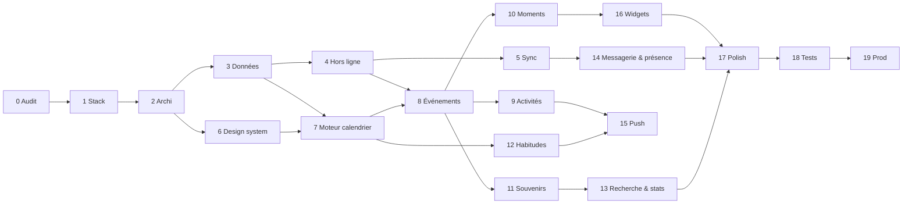

# Nous — Roadmap technique du calendrier mobile

> **Statut : proposition, en attente de validation.** Aucune ligne de code applicatif
> n'est écrite tant que les Phases 0 à 3 (audit, stack, architecture, modèle de données)
> ne sont pas validées. Ce document est le contrat : un autre développeur doit pouvoir
> reprendre le projet à n'importe quelle phase avec lui seul.
>
> Documents liés : [00 Audit](00-audit.md) · [01 Stack](01-stack.md) ·
> [02 Architecture](02-architecture.md) · [03 Modèle de données](03-modele-de-donnees.md) ·
> [04 Sync & hors ligne](04-sync-offline.md) · [05 Design system](05-design-system-mobile.md) ·
> [06 Moteur calendrier](06-moteur-calendrier.md) · [07 Questions ouvertes](07-questions-ouvertes.md) ·
> [ADR](adr/)

## 0. Lecture rapide

| Phase | Titre                                  | Dépend de | Livrable vérifiable                                                     |
| ----- | -------------------------------------- | --------- | ----------------------------------------------------------------------- |
| 0     | Audit                                  | —         | `docs/00-audit.md` ✅                                                    |
| 1     | Stack mobile                           | 0         | `docs/01-stack.md`, ADR-001 — **validation attendue**                    |
| 2     | Architecture & monorepo                | 1         | Monorepo pnpm, app Expo qui démarre sur téléphone, web non régressé, CI |
| 3     | Modèle de données & repositories       | 2         | Migrations SQL, schéma SQLite, repositories testés en Node, import v1   |
| 4     | Stockage local & hors ligne            | 3         | CRUD complet en mode avion, outbox persistante, FTS                     |
| 5     | Synchronisation temps réel             | 4         | Deux téléphones convergent (LWW), écho ignoré, rattrapage après coupure |
| 6     | Design system mobile                   | 2         | `packages/theme`, `ui/*`, galerie de composants, sheet, pickers          |
| 7     | Moteur calendrier                      | 3, 6      | Vues Jour/Semaine/Mois/Année, drag/resize/create, pager                 |
| 8     | Événements personnels                  | 4, 7      | Créer/éditer/supprimer/restaurer, lieux, conflits, multi-jours          |
| 9     | Activités à deux & propositions        | 8         | Bulle : accepter / refuser / contre-proposer, événement spécial         |
| 10    | Moments importants & chapitres         | 7, 8      | Constellation, occurrences annuelles, chapitres, comptes à rebours      |
| 11    | Souvenirs & médias                     | 4, 8      | Photos/vidéos hors ligne, file d'envoi, galerie, lightbox               |
| 12    | Habitudes & récurrence                 | 7         | Moteur de récurrence, occurrences, fait/pas fait, rattraper, relance    |
| 13    | Recherche & statistiques               | 4, 8, 11  | Périodes naturelles, filtres, « Nos statistiques » masquable            |
| 14    | Messagerie & présence                  | 5         | Conversation temps réel, réactions, présence, bulles d'activité         |
| 15    | Notifications push                     | 5, 9, 12  | Push inter-personnes, préférences, liens profonds                       |
| 16    | Widgets iOS / Android                  | 10        | Widget « Encore 24 dodos » avec photo, 3 tailles                        |
| 17    | Polish UX & animations                 | 8–16      | Haptique, reduced-motion, personnalisation, onboarding mobile           |
| 18    | Tests complets                         | 17        | E2E Maestro, chaos de sync, accessibilité, performance                  |
| 19    | Optimisation & production              | 18        | Builds EAS, distribution privée, durcissement Supabase, supervision      |



## 1. Règles de conduite (valables pour toutes les phases)

1. **À chaque phase** : expliquer ce qui va être fait → lister les fichiers → implémenter →
   tester → corriger → vérifier l'architecture (règle de dépendance des couches, taille
   des fichiers, absence de logique métier dans l'UI) → seulement ensuite passer à la
   suivante. Une phase se termine par une PR nommée `phase-N-…` avec sa *définition de
   fini* cochée.
2. **Définition de fini** commune : typecheck vert, lint vert, tests verts, `apps/web`
   se construit encore, `expo doctor` vert, aucun `any`, aucun `TODO` sans ticket,
   composants < 200 lignes sauf justification en commentaire, décision non évidente →
   ADR ou commentaire « pourquoi ».
3. **Rien n'est supprimé du web** avant que le mobile ne soit en production.
4. **La logique métier vit dans `packages/domain`**, testée en Node. Si un composant
   contient un calcul de date, une règle de proposition ou une requête, c'est une
   erreur d'architecture à corriger dans la phase.
5. **Migrations serveur additives** jusqu'à la Phase 19 : on n'altère jamais le contrat
   `items(collection, data)` lu par le web.
6. **Deux téléphones réels** (un iOS, un Android) dès la Phase 2 : chaque phase ≥ 4 est
   vérifiée sur les deux, en mode avion puis en ligne.

## 2. Structure cible du dépôt

```
nous/
├─ apps/
│  ├─ web/                        site v1 (déplacé tel quel, gelé — ADR-002)
│  └─ mobile/
│     ├─ app/                     routes Expo Router
│     ├─ src/
│     │  ├─ ui/                   design system mobile (05)
│     │  ├─ providers/            Theme, Motion, Session, Data, Sync, Presence, Notifications
│     │  ├─ features/
│     │  │  ├─ home/  calendar/  events/  proposals/  moments/  memories/
│     │  │  ├─ habits/  countdowns/  messages/  presence/  search/  stats/
│     │  │  └─ settings/  trash/  onboarding/  auth/
│     │  └─ native/               WidgetBridge, App Group, snapshot
│     ├─ targets/                 widget iOS (Swift), widget Android
│     ├─ assets/                  polices, tuile de grain, icône, splash
│     ├─ app.config.ts  eas.json  maestro/
├─ packages/
│  ├─ domain/                     entités, moteurs, interfaces (TS pur)
│  ├─ data/                       SQLite, sync, Supabase, médias, auth, presence, push
│  ├─ theme/                      tokens.ts → tokens.css (web) + createTheme (mobile)
│  └─ icons/                      paths SVG + IconName
├─ supabase/
│  ├─ migrations/                 0001_couples … 00NN
│  ├─ functions/                  push/  purge-trash/
│  ├─ scripts/                    migrate-v1.ts
│  └─ seed/
├─ docs/                          ce dossier
├─ .github/workflows/ci.yml
├─ pnpm-workspace.yaml  package.json  tsconfig.base.json  .eslintrc.cjs  .prettierrc
```

## 3. Les phases

---

### Phase 0 — Audit ✅

Fait : [00-audit.md](00-audit.md). Six dettes disqualifiantes (D1–D6) et treize
bloquantes/kit (D7–D19) identifiées avec preuves ; inventaire du réutilisable.

---

### Phase 1 — Choix / validation de la stack mobile

**Objectif.** Trancher, justifier, documenter. **Point de validation avec le couple.**

**Livrables.** [01-stack.md](01-stack.md) (comparatif sur 16 critères, verdict),
[ADR-001](adr/ADR-001-stack-react-native-expo.md). Réponses aux questions T1–T8 de
[07](07-questions-ouvertes.md) : réactivation du projet Supabase, compte Apple Developer,
comptes existants.

**Fini quand** : la stack est validée par écrit, le projet Supabase est réactivé (ou
recréé) et les deux `auth.uid()` sont connus.

---

### Phase 2 — Architecture générale et monorepo

**Objectif.** Poser la coquille dans laquelle tout le reste s'emboîte, **sans
fonctionnalité**, en prouvant que le web ne régresse pas.

**Pourquoi maintenant.** Tout ce qui suit dépend de la règle de dépendance des couches ;
la poser après coup coûte une réécriture.

**Fichiers.**

- `pnpm-workspace.yaml`, `package.json` racine (scripts `typecheck`, `lint`, `test`,
  `web:build`, `mobile:*`), `tsconfig.base.json` (strict + `noUncheckedIndexedAccess` +
  `exactOptionalPropertyTypes`), `.eslintrc.cjs` (typescript-eslint, react-hooks,
  `import/no-restricted-paths` entre couches), `.prettierrc`, `.github/workflows/ci.yml`.
- `apps/web/**` ← `git mv` de `src/`, `index.html`, `vite.config.ts`, `supabase/schema.sql`
  reste à la racine `supabase/` (renommé `legacy/schema.sql`).
- `apps/mobile/` ← `create-expo-app` (SDK 56, Expo Router, TypeScript), `app.config.ts`
  (scheme `nous`, bundle ids, plugins : expo-font, expo-sqlite, expo-notifications,
  expo-secure-store, expo-image, expo-haptics, expo-blur), `eas.json` (profils
  development / preview / production).
- `packages/domain/src/{dates,utils}/` ← extraction et **correction** de `lib/date.ts`
  (D7, D8 : jour civil local, DST, 29 février) et `lib/utils.ts` ; tests Vitest avant
  extraction (caractérisation), puis après.
- `packages/data/src/auth/nickname.ts` ← `lib/login.ts` (config injectée).
- `packages/theme/src/tokens.ts` + `scripts/generate-css.ts` → régénère
  `apps/web/src/styles/tokens.css` **octet pour octet** (test de snapshot).
- `packages/icons/src/{paths.ts,index.ts}` ← `Icon.tsx:15-70`.
- `apps/web` importe désormais `@nous/domain`, `@nous/theme`, `@nous/icons`
  (non-régression : `pnpm web:build` + comparaison visuelle manuelle des 12 pages).
- `apps/mobile/src/providers/{ThemeProvider,MotionProvider,SessionProvider}.tsx`,
  `app/_layout.tsx`, `app/(auth)/login.tsx` (surnom + mot de passe, Supabase Auth,
  session dans `expo-secure-store`), `app/(tabs)/_layout.tsx` avec cinq onglets vides.
- Polices Fraunces (instances 400/500/600 + italiques) et Inter embarquées ; tuile de grain.

**Interfaces créées.** `Theme`, `MotionConfig`, `Session { user, profile?, couple? }`.

**Tests.** `packages/domain/dates` (≥ 40 cas dont DST 2026-03-29 et 2026-10-25, 29/02),
snapshot `tokens.css`, `pnpm web:build`, `expo doctor`, dev build installé sur les deux
téléphones : connexion réussie, thème et polices visibles.

**Fini quand** : la CI est verte, le web est identique, l'app mobile se connecte.

**Effort indicatif.** 4–6 jours.

---

### Phase 3 — Modèle de données et repositories

**Objectif.** Faire exister le modèle de [03](03-modele-de-donnees.md) aux trois endroits
(domaine, SQLite, Postgres) et prouver leur cohérence par des tests, sans UI.

**Fichiers.**

- `packages/domain/src/entities/*.ts` : types + schémas zod pour `Couple`, `Profile`,
  `Event` (union `PersonalEvent | CoupleActivity`), `Proposal`, `ImportantMoment`,
  `MomentOccurrence`, `Chapter`, `Countdown`, `Memory`, `Media`, `Habit`,
  `HabitOccurrence`, `Message`, `Reaction`, `Notification`, `NotificationPreferences`,
  `PushToken`, `ChangeLogEntry`, `LegacyItem`. Enums (`EventKind`, `EventStatus`,
  `ProposalStatus`, `MomentKind`, `Mood`, `Category`…).
- `packages/domain/src/repositories/*.ts` : interfaces (`EventRepository`,
  `ProposalRepository`, …) + `SyncedRepository<T>` commun (`getById`, `upsert`,
  `softDelete`, `restore`, `listTrash`, `changesSince`) + types de requêtes (`DateRange`).
- `packages/domain/src/services/` : `proposeActivity`, `respondToProposal`,
  `ensureOccurrence`, `defaultChapters` (logique pure, dépend des interfaces).
- `packages/data/src/schema/*.ts` (Drizzle, SQLite) + `drizzle/` migrations embarquées ;
  `packages/data/src/repositories/*.ts` (SQLite) ; `packages/data/src/testing/memory/*.ts`
  (implémentations en mémoire).
- `supabase/migrations/0001_identity.sql` (couples, profiles, `auth_couple_id()`,
  trigger de création de profil), `0002_calendar.sql` (events, proposals),
  `0003_moments.sql`, `0004_memories_media.sql`, `0005_habits.sql`,
  `0006_messaging.sql`, `0007_notifications.sql`, `0008_history_trash.sql`
  (change_log, `deleted_at`, pg_cron purge), `0009_sync.sql` (triggers
  `server_updated_at`, garde LWW, `realtime.broadcast_changes` sur chaque table,
  policies `realtime.messages`), `0010_legacy_items.sql` (colonnes `server_updated_at`,
  `deleted_at`, index sur `items` — additif).
- `supabase/scripts/migrate-v1.ts` : `items(settings)` → `couples` + `profiles`
  (mapping `space` → couple, `setupBy`/comptes → profils), références `cloud:` →
  lignes `media(owner_type='legacy')`. Rejouable (idempotent), à sec par défaut.
- `supabase/seed/dev.sql` : un couple de test avec deux comptes.

**Données / décisions à figer ici.** Règle du 29 février, catalogue de catégories,
catalogue de `mood`, limites (200 lignes de `change_log` par couple, 30 jours de
corbeille).

**Tests.** Domaine : invariants zod, `occurrenceDate` (29/02 selon les deux règles),
machine de propositions (table de transitions complète), `defaultChapters`.
Repositories (Node + better-sqlite3) : CRUD + corbeille + `changesSince` pour chaque
table, transaction rollback. SQL : sur une **branche Supabase** de test, script
`supabase/tests/*.sql` (pgTAP) — LWW refuse une écriture plus ancienne, RLS croisée
(couple B ne voit rien de A), `delete_message` après 6 min refusé, purge.

**Fini quand** : `pnpm test` couvre les trois couches ; les migrations s'appliquent
sur la branche de test et le web v1 y fonctionne toujours ; `migrate-v1.ts` à sec
produit le rapport attendu sur les données réelles.

**Effort.** 6–8 jours.

---

### Phase 4 — Stockage local et hors ligne

**Objectif.** L'app lit et écrit **uniquement** dans SQLite ; tout fonctionne en mode
avion ; les écritures sont mises en file.

**Fichiers.**

- `packages/data/src/db/{open.ts,migrate.ts,events.ts}` : ouverture expo-sqlite, migrations
  Drizzle au démarrage, `DataEvents` (bus par table).
- `packages/data/src/outbox/{Outbox.ts,types.ts}` : table `outbox`, fusion par ligne,
  `enqueue` dans la transaction du repository.
- `packages/data/src/kv/` (MMKV) : `device_id`, préférences, curseurs.
- `packages/data/src/search/fts.ts` : table FTS5 + triggers SQLite.
- `packages/data/src/media/LocalMediaStore.ts` : fichiers locaux, miniatures.
- `apps/mobile/src/providers/DataProvider.tsx` (ouvre la base, expose les repositories),
  `QueryProvider` (TanStack Query + invalidation par `DataEvents`).
- `apps/mobile/app/dev/data.tsx` : écran de développement (compteurs par table, outbox,
  bouton « vider », export JSON) — indispensable pour les phases suivantes.
- Hooks génériques `useRepoQuery(table, key, fn)` / `useRepoMutation`.

**Interfaces.** `Outbox`, `DataEvents`, `LocalMediaStore`, `KeyValueStore`.

**Tests.** Repositories → outbox (chaque écriture produit exactement une entrée fusionnée) ;
FTS mis à jour ; sur téléphone : mode avion, créer/modifier/supprimer/restaurer 20
objets via l'écran dev, tuer l'app, relancer : tout est là, outbox = 20.

**Fini quand** : aucune requête réseau n'est nécessaire pour utiliser l'app après la
première connexion ; la file survit au redémarrage.

**Effort.** 4–5 jours.

---

### Phase 5 — Synchronisation temps réel

**Objectif.** Implémenter [04](04-sync-offline.md) §6–8 : push, pull, temps réel,
LWW, écho, rattrapage, état visible.

**Fichiers.**

- `packages/data/src/sync/{SyncEngine.ts,Pusher.ts,Puller.ts,applyRemote.ts,cursors.ts,backoff.ts}`.
- `packages/data/src/realtime/{RealtimeClient.ts,channel.ts}` : canal `couple:{id}`,
  routage broadcast / presence.
- `packages/data/src/supabase/{client.ts,tables.ts}` : client configuré pour RN
  (`expo-secure-store` pour la session, `NetInfo`, `AppState`).
- `packages/data/src/sync/registry.ts` : liste des tables synchronisées et de leurs
  schémas (ajouter une table = une ligne).
- `apps/mobile/src/providers/SyncProvider.tsx`, `features/settings/ui/SyncStatus.tsx`
  (« Synchronisé · 3 en attente · hors ligne »).
- `packages/data/src/testing/FakeServer.ts` : serveur en mémoire qui rejoue les triggers
  LWW et diffuse.

**Tests.** Unitaires `applyRemote` (matrice LWW × dirty), fusion outbox, backoff.
Intégration `SyncEngine` + `FakeServer` : ordres aléatoires push/pull/realtime, coupures,
deux clients. Intégration Supabase (branche) : `broadcast_changes` reçu < 1 s, écho
ignoré, rattrapage après `TIMED_OUT`. Sur deux téléphones : modifier le même objet
hors ligne sur les deux, reconnecter → convergence sur le plus récent, aucun doublon.

**Fini quand** : le test « deux téléphones, 100 écritures croisées, mode avion aléatoire »
converge à 100 % trois fois de suite.

**Effort.** 6–8 jours.

---

### Phase 6 — Design system mobile du calendrier

**Objectif.** [05](05-design-system-mobile.md) : que chaque écran à venir soit construit
avec des briques qui *sont* Nous.

**Fichiers.**

- `packages/theme/src/{tokens.ts,createTheme.ts,motion.ts,contrast.test.ts}`.
- `apps/mobile/src/ui/{Text,Button,Card,Chip,Segmented,Sheet,FormSheet,useConfirm,Toast,Field,Input,Textarea,Switch,DateField,TimeField,DurationField,PersonPicker,Avatar,Icon,Img,Lightbox,Empty,Stat,Progress,Divider,PageHeader,Grain}.tsx`
  + `ui/index.ts`.
- `apps/mobile/src/providers/{ThemeProvider,MotionProvider}.tsx` (finalisés : densité,
  `motion.level`, palette animée).
- `apps/mobile/app/dev/ui.tsx` : galerie de tous les composants dans les 4 thèmes.
- `apps/mobile/app/(tabs)/_layout.tsx` : tabbar définitive (5 onglets, « + » central).

**Tests.** Contrastes AA automatiques ; captures Maestro de la galerie (light/dark ×
automne/bleu) comparées à la main au web ; cibles ≥ 44 pt vérifiées par un test de
mesure ; reduced-motion : toutes les animations passent par `useMotion()` (lint custom :
interdiction d'importer `withSpring` hors de `ui/` et `features/*/ui/`).

**Fini quand** : la galerie est validée visuellement par le couple sur les deux
téléphones.

**Effort.** 6–8 jours.

---

### Phase 7 — Moteur calendrier

**Objectif.** [06](06-moteur-calendrier.md) : la logique pure et les quatre vues, avec
des données de démonstration (repositories en mémoire), sans formulaire.

**Fichiers.**

- `packages/domain/src/calendar/{items.ts,window.ts,layoutDay.ts,layoutBands.ts,snap.ts,conflicts.ts,grids.ts,navigation.ts}` + tests.
- `apps/mobile/src/features/calendar/{hooks/useCalendarRange.ts,hooks/useCalendarItems.ts,store.ts}` (Zustand : vue, date ancrée, hauteur de slot).
- `apps/mobile/src/features/calendar/ui/{TimeGrid,DayColumn,EventBlock,AllDayBand,NowLine,DayPager,WeekView,MonthGrid,MonthCell,YearOverview,ViewSwitch,DateStrip}.tsx`.
- `apps/mobile/src/features/calendar/gestures/{useDragEvent.ts,useResizeEvent.ts,useCreateByLongPress.ts,usePinchSlotHeight.ts}` (Reanimated + Gesture Handler, appellent `snap*`).
- `apps/mobile/app/(tabs)/calendar/{_layout,index,[view]}.tsx`.

**Tests.** Contrat de tests de [06 §5](06-moteur-calendrier.md) ; test de performance :
vue Semaine avec 300 items rend < 16 ms par frame de scroll sur l'Android de test ;
gestes : drag d'un bloc de 9:00 à 10:30 → `moveWindow` appelé avec `deltaSlots = 3`,
haptique au snap.

**Fini quand** : on navigue Jour ↔ Semaine ↔ Mois ↔ Année au swipe, on déplace et
étire des blocs de démonstration, tout respecte la densité et reduced-motion.

**Effort.** 8–10 jours.

---

### Phase 8 — Événements personnels

**Objectif.** Premier flux complet : créer, voir, modifier, déplacer, supprimer,
restaurer un événement, hors ligne et synchronisé.

**Fichiers.**

- `packages/domain/src/services/events.ts` (`createEvent`, `moveEvent`, `resizeEvent`,
  `setUntimed`, `validateWindow`), `domain/locations/` (`Location`, normalisation ville).
- `packages/data/src/geocode/{Geocoder.ts,nominatim.ts}` (annulation, cache, throttle 1 rps,
  `User-Agent`).
- `features/events/{hooks/useEvent.ts,hooks/useSaveEvent.ts,ui/EventSheet.tsx,ui/EventPreview.tsx,ui/CategoryPicker.tsx,ui/LocationField.tsx,ui/ConflictHint.tsx,ui/HistoryList.tsx}`.
- `app/sheets/event/{new,[id]}.tsx` ; `features/trash/{screen,ui/TrashRow}.tsx` ;
  `app/(tabs)/more/trash.tsx`.
- Toast avec action « Annuler » après un déplacement (restaure la fenêtre précédente).

**Tests.** Domaine (`validateWindow`, fin > début, multi-jours) ; Maestro : créer un
événement hors ligne, le déplacer, le supprimer, le restaurer depuis la corbeille, le
voir apparaître sur l'autre téléphone < 2 s en ligne ; historique « Modifié par Mimi ».

**Fini quand** : le couple utilise le calendrier pour ses événements réels pendant une
semaine sans perte.

**Effort.** 5–6 jours.

---

### Phase 9 — Activités à deux et propositions

**Objectif.** La bulle romantique : proposer, accepter, refuser, contre-proposer ;
l'activité acceptée devient un événement spécial (et **pas** un souvenir).

**Fichiers.**

- `packages/domain/src/proposals/{machine.ts,snapshot.ts}` (transitions, diff de
  contre-proposition « samedi au lieu de vendredi, 20 h au lieu de 19 h »).
- `packages/domain/src/services/proposals.ts` (`proposeActivity`, `accept`, `decline`,
  `counter`, `withdraw` — écrivent `events` + `proposals` + `notifications`).
- `features/proposals/{hooks,ui/ProposalBubble.tsx,ui/CounterProposalForm.tsx,ui/ProposalHistory.tsx,ui/ActivityBlock.tsx,screen/ProposalsScreen.tsx}` ;
  animations : accepter (cœur spring `soft` + pluie de cœurs 1,1 s + onde), refuser
  (recul, tremblement, fuite spring `lively`, 💨), contre-proposer (secousse + remount).
- `app/sheets/activity/{new,[id]}.tsx`, `app/(tabs)/more/proposals.tsx`, carte
  « Proposition en attente » sur l'accueil.

**Tests.** Table de transitions complète (dont : contre-proposition sur une
contre-proposition, retrait, acceptation d'un tour périmé refusée) ; Maestro sur deux
téléphones : A propose, B contre-propose, A accepte → événement `accepted` chez les
deux avec les valeurs de B ; reduced-motion : les mêmes actions sans animation.

**Fini quand** : Q2 et Q3 de [07](07-questions-ouvertes.md) sont tranchées et
implémentées.

**Effort.** 6–7 jours.

---

### Phase 10 — Moments importants, chapitres, comptes à rebours

**Objectif.** La mémoire vivante : constellation/timeline, occurrences annuelles,
chapitres, « Encore 24 dodos ».

**Fichiers.**

- `packages/domain/src/moments/{occurrence.ts,chapters.ts}`, `domain/countdowns/{target.ts,label.ts,reminders.ts}` (+ `widgetEntries`).
- `features/moments/{ui/Constellation.tsx (react-native-svg + Reanimated),ui/MomentStar.tsx,ui/OccurrenceScreen.tsx,ui/ChapterList.tsx,ui/ChapterEditor.tsx,ui/MoodPicker.tsx,ui/MomentSheet.tsx}`.
- `features/countdowns/{ui/CountdownCard.tsx,ui/ReminderSettings.tsx,hooks/useNextDates.ts}`.
- `app/(tabs)/memories/moments/{index,[momentId]/[year]}.tsx`, `app/sheets/moment/…`,
  `app/sheets/countdown/…` ; carte « Prochaine date » de l'accueil (héritière de `.upnext`).
- Import des données v1 : `couples.start_date` → moment `anniversary` créé par le script
  de migration.

**Tests.** `occurrenceDate` (déjà), `defaultChapters` aux quatre bornes horaires, `dodos`
(J-1 = « Encore 1 dodo », J = « C'est aujourd'hui »), rappels J-7/J-1 planifiés puis
replanifiés quand on change les préférences ; Maestro : créer « Première rencontre »
récurrente, ouvrir 2027, renommer « Soirée », déplacer un chapitre, y attacher un
événement.

**Fini quand** : la constellation affiche les moments réels du couple avec leurs
années et photos ; le compte à rebours de l'accueil est juste à minuit.

**Effort.** 7–9 jours.

---

### Phase 11 — Souvenirs et médias

**Objectif.** Photos et vidéos hors ligne, liées à un événement, une occurrence ou un
chapitre ; « Ajouter à la Galerie » ; galerie unifiée.

**Fichiers.**

- `packages/data/src/media/{MediaPipeline.ts,compress.ts,thumbnails.ts,MediaUploader.ts,signedUrls.ts}` (expo-image-picker, react-native-compressor, expo-video-thumbnails, Storage).
- `packages/domain/src/services/memories.ts` (créer depuis « + », depuis une date, depuis
  un événement ; rattachement automatique à un chapitre par bornes horaires).
- `features/memories/{ui/MemorySheet.tsx,ui/MediaPicker.tsx,ui/MediaGrid.tsx,ui/MemoryCard.tsx,ui/MemoryStamp.tsx,ui/UploadQueue.tsx,screen/GalleryScreen.tsx}` ;
  `ui/Lightbox` finalisée (pan/pinch/dismiss/vidéo).
- `app/(tabs)/memories/{index,gallery,[memoryId]}.tsx`, `app/sheets/memory/…`.
- Import v1 : `media(owner_type='legacy')` visibles dans la galerie.

**Tests.** Pipeline sur fichiers de référence (HEIC, portrait EXIF, vidéo 4K 30 s → 1080p) ;
reprise d'envoi après kill de l'app ; Maestro : ajouter 10 photos + 1 vidéo hors ligne à
un événement, reconnecter, vérifier sur l'autre téléphone (miniatures d'abord) ;
suppression → corbeille → restauration → média toujours là ; purge sur la branche de
test après 30 jours simulés.

**Fini quand** : la galerie de l'app contient tout (v1 + nouveaux) et fonctionne hors ligne.

**Effort.** 7–9 jours.

---

### Phase 12 — Habitudes et récurrence

**Objectif.** Moteur de récurrence robuste, suivi par occurrence, relance, rattrapage.

**Fichiers.**

- `packages/domain/src/recurrence/{rule.ts,iterate.ts,describe.ts (« Tous les 3 mercredis »),toRRule.ts}` + tests exhaustifs (ADR-004).
- `packages/domain/src/habits/{status.ts,catchUp.ts}`, `domain/notifications/scheduler.ts`
  (plan local : relances, rappels, horizon 14 jours, plafond 60).
- `packages/data/src/push/LocalScheduler.ts` (expo-notifications, local seulement ici).
- `features/habits/{ui/HabitSheet.tsx,ui/RecurrenceField.tsx,ui/AdvancedRecurrence.tsx,ui/HabitPill.tsx,ui/DidYouPrompt.tsx,ui/CatchUpSheet.tsx,screen/HabitsScreen.tsx}`.
- `app/(tabs)/more/habits.tsx`, `app/sheets/habit/…`.

**Tests.** Récurrence : tables de vérité (quotidien, toutes les 3 semaines lundi+mercredi,
15 du mois, dernier jour, 2e lundi, annuel, `UNTIL`, `COUNT`, mois de 31 → 30) +
propriétés ; « un seul des deux suffit » (Q7) ; rattrapage crée l'événement lié (Q8) ;
la relance locale part à `time_of_day + 60 min` et est annulée si l'autre a coché.

**Fini quand** : une habitude réelle du couple tourne une semaine avec relances.

**Effort.** 6–7 jours.

---

### Phase 13 — Recherche et statistiques

**Objectif.** Recherche unifiée avec périodes naturelles ; « Nos statistiques ».

**Fichiers.**

- `packages/domain/src/search/{periods.ts (« l'été dernier », « en août », « il y a 6 mois », « la semaine dernière », « en 2024 », « à Noël »),query.ts,rank.ts}` + tests.
- `packages/data/src/search/{SearchRepository.ts}` (FTS5 + filtres type/période/catégorie).
- `packages/domain/src/stats/{aggregate.ts,timeline.ts}` ; `packages/data/src/stats/StatsRepository.ts` (SQL).
- `features/search/{ui/SearchBar.tsx,ui/Filters.tsx,ui/ResultRow.tsx,screen/SearchScreen.tsx}` ;
  `features/stats/{ui/StatTile.tsx,ui/Sparkline.tsx (react-native-svg),ui/CategoryRing.tsx,screen/StatsScreen.tsx}` ; réglage « Masquer les statistiques ».
- `app/(tabs)/more/{search,stats}.tsx` + accès par l'icône loupe de l'accueil.

**Tests.** Parseur de périodes (≥ 60 phrases) ; recherche « restaurant août » → résultats
attendus sur le jeu de seed ; stats : mêmes chiffres que des requêtes SQL de contrôle.

**Effort.** 5–6 jours.

---

### Phase 14 — Messagerie et présence temps réel

**Objectif.** Une conversation texte + réactions ; présence partout ; bulles d'activité
éphémères ; bouton message rapide.

**Fichiers.**

- `packages/data/src/presence/{PresenceClient.ts,heartbeat.ts}`, `packages/domain/src/presence/{status.ts (en ligne / actif il y a / hors ligne, tolérance 90 s),activity.ts (dérivation des bulles)}`.
- `packages/domain/src/services/messages.ts` (envoi, suppression < 5 min, lu/non-lu).
- `features/messages/{ui/MessageList.tsx (FlashList inversée),ui/MessageBubble.tsx,ui/ReactionBar.tsx,ui/Composer.tsx,ui/UnreadDivider.tsx,screen/MessagesScreen.tsx}`.
- `features/presence/{store.ts,ui/PresenceBadge.tsx,ui/ActivityBubble.tsx,ui/QuickMessageButton.tsx,hooks/useReportScreen.ts}` ; `PresenceBadge` dans la topbar de tous les écrans.
- `app/(tabs)/messages/index.tsx` ; badge non-lus sur l'onglet.
- Migration : fonction `delete_message`, policies.

**Tests.** Statut de présence (tolérance, arrière-plan), dérivation des bulles (« Mimi
vient d'ajouter une activité » seulement si `updated_by ≠ moi` et < 30 s), suppression
à 4 min 59 acceptée / 5 min 01 refusée (SQL) ; Maestro deux téléphones : « Mimi écrit… »,
« Mimi consulte le calendrier », message reçu < 1 s, non-lus, réaction.

**Effort.** 6–7 jours.

---

### Phase 15 — Notifications push

**Objectif.** [ADR-007](adr/ADR-007-notifications-locales-vs-serveur.md) côté serveur :
push inter-personnes, préférences, liens profonds.

**Fichiers.**

- `supabase/migrations/0011_notification_triggers.sql` (insertion dans `notifications`
  sur message, proposition, réponse, habitude faite, photos ajoutées à une occurrence),
  `supabase/functions/push/index.ts` (webhook → Expo Push Service, respect des
  préférences et heures calmes), `supabase/functions/push/README.md` (secrets).
- `packages/data/src/push/{PushRegistrar.ts,handlers.ts}` ; `features/settings/ui/NotificationPreferences.tsx` ;
  `app/(tabs)/more/settings/notifications.tsx` ; routage des liens profonds dans `app/_layout.tsx`.
- Suppression de la bannière si l'écran concerné est au premier plan.

**Tests.** Fonction Edge testée en local (Deno) avec des payloads de référence ;
Maestro : message reçu en arrière-plan → notification → tap → conversation ouverte ;
préférence « propositions » désactivée → rien reçu.

**Effort.** 4–5 jours.

---

### Phase 16 — Widgets iOS / Android

**Objectif.** [ADR-006](adr/ADR-006-widgets-natifs-par-snapshot.md).

**Fichiers.**

- `apps/mobile/src/native/WidgetBridge.ts` + module Expo `widget-bridge/` (écriture du
  snapshot et de l'image dans le conteneur partagé, rafraîchissement des widgets).
- `apps/mobile/targets/nous-widget/` (Swift : `TimelineProvider`, trois familles, vue
  SwiftUI reprenant Fraunces/crème/accent), `apple-targets.config.js`, entitlements App Group.
- `apps/mobile/widgets/android/` (`react-native-android-widget` : `CountdownWidget.tsx`,
  tâche de mise à jour), configuration `app.config.ts`.
- `features/countdowns/ui/WidgetSettings.tsx` (épingler une date, choisir la photo).

**Tests.** `widgetEntries` (domaine) ; snapshot écrit à chaque changement ; sur les deux
téléphones : widget petit/moyen/grand, changement de jour à minuit sans ouvrir l'app,
tap → écran du moment.

**Effort.** 6–8 jours (dont apprentissage natif).

---

### Phase 17 — Polish UX et animations

**Objectif.** Que tout paraisse d'une seule main.

**Contenu.** Onboarding mobile (reprend le flux v1 sans « qui es-tu ? ») ; écran
Réglages complet (personnalisation : densité, animations, informations visibles, vue par
défaut, semaine, présence, statistiques masquées, corbeille, synchronisation, données) ;
audit reduced-motion écran par écran ; haptiques ; états vides et erreurs ; transitions
partagées (vignette → lightbox) ; accessibilité (labels, ordre de lecture, contraste) ;
revue de toute la copy avec le couple ; palette « bleu » et sombre vérifiés partout ;
« la demande » portée en natif (bonus).

**Fini quand** : une session de test de 30 min avec le couple ne remonte plus que des
souhaits, pas des irritants.

**Effort.** 6–8 jours.

---

### Phase 18 — Tests complets

**Contenu.** Suites Maestro : parcours critiques × 2 OS × hors ligne / en ligne ; test de
chaos de sync (script qui coupe le réseau aléatoirement pendant 10 min d'écritures sur
deux appareils, puis vérifie la convergence table par table) ; test de charge locale
(5 000 événements, 20 000 messages, 3 000 médias) : temps d'ouverture, scroll semaine,
recherche < 100 ms ; audit d'accessibilité (VoiceOver / TalkBack sur 6 écrans) ;
couverture : `domain` ≥ 90 %, `data` ≥ 80 % ; revue de sécurité (RLS, Storage, fonctions,
secrets, `signUp` désactivé).

**Effort.** 5–6 jours.

---

### Phase 19 — Optimisation et préparation production

**Contenu.** Profilage (Hermes, Reanimated, listes) et corrections ; limites de cache
d'images et purge locale ; builds EAS `production` iOS (TestFlight interne) et Android
(APK signé, lien privé) ; `expo-updates` pour les correctifs JS ; Supabase : `signUp`
désactivé, sauvegardes, `pg_cron` purge actif, quotas Storage, alertes ; supervision
(Sentry RN + Edge Functions) ; runbook (`docs/RUNBOOK.md` : réactiver un projet en pause,
réinitialiser un mot de passe, restaurer une sauvegarde, réémettre un build) ;
`README.md` réécrit pour le monorepo ; migration réelle des données v1 (`migrate-v1.ts`
en vrai, après sauvegarde) ; bascule du couple sur l'app.

**Fini quand** : les deux téléphones tournent la version production depuis TestFlight /
APK, les données v1 sont visibles, le web v1 fonctionne toujours.

**Effort.** 5–7 jours.

---

## 4. Après la roadmap (hors périmètre, mais prévu par l'architecture)

- **Portage des sections v1** (aventures, mots, Airbnb, carte, bucket list, awards,
  capsules, moodboard) vers des tables dédiées et des écrans mobiles, une section par
  itération, en commençant par celles qui nourrissent le calendrier (aventures →
  souvenirs, capsules → comptes à rebours). Le moteur de sync et le design system sont
  prêts ; `items` reste synchronisé entre-temps.
- **Desktop / web** : Expo web ou réécriture des pages sur `packages/domain`.
- **Live Activities** iOS pour le jour J d'un moment important.

## 5. Estimation globale

Somme des efforts indicatifs : **≈ 105–135 jours** de développement pour une personne
assistée, phases 2 à 19. Les phases 6, 7, 10 et 11 sont les plus incertaines (UI riche
et gestes) ; les phases 3, 4, 5 sont les plus déterminantes (tout le reste s'appuie
dessus : ne pas les compresser).

## 6. Risques et parades

| Risque | Parade |
| ------ | ------ |
| Sync maison qui « presque » marche | Phase 5 avec faux serveur + chaos test avant toute UI ; critère de convergence 3/3. |
| Grille lente sur Android modeste | Mesure dès la Phase 7 avec 300 items ; rendu par colonne mémoïsé ; slot height fixe pendant le scroll. |
| Natif des widgets (Swift/Kotlin) | Snapshot simple, périmètre minimal, une seule vue SwiftUI ; possibilité de livrer iOS d'abord. |
| Bibliothèques Expo alpha (`@expo/ui`, `expo-widgets`) | Non utilisées dans le chemin critique ; gorhom + WidgetKit natif. |
| Dérive « site responsive » | Deux téléphones réels à chaque phase ; galerie de composants validée par le couple. |
| Projet Supabase en pause / quota gratuit | Réactivation en Phase 1 ; alerte si pas d'accès 5 jours (les pushs quotidiens de sync suffisent à le garder actif). |
| Perte de données à la migration v1 | `migrate-v1.ts` idempotent, à sec d'abord, sauvegarde JSON avant, web v1 conservé. |
